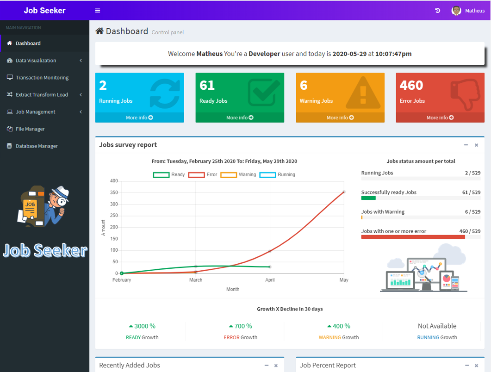
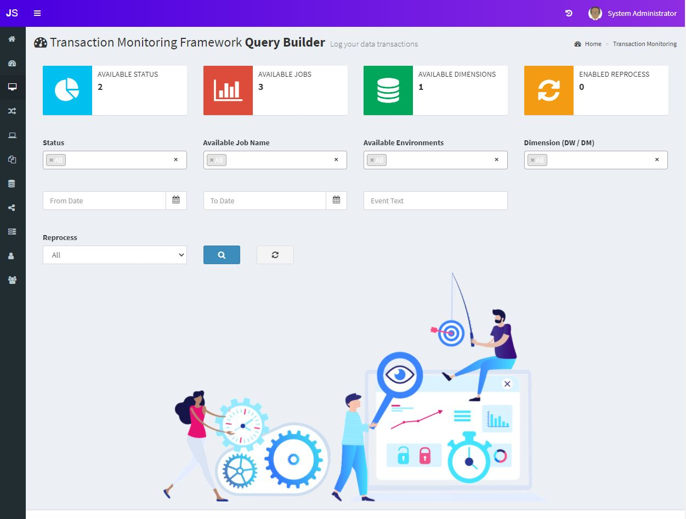
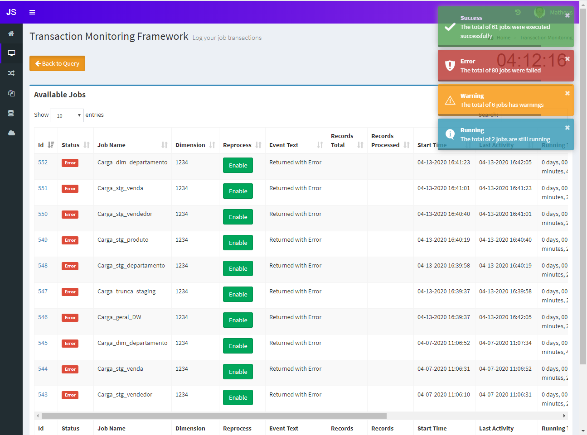
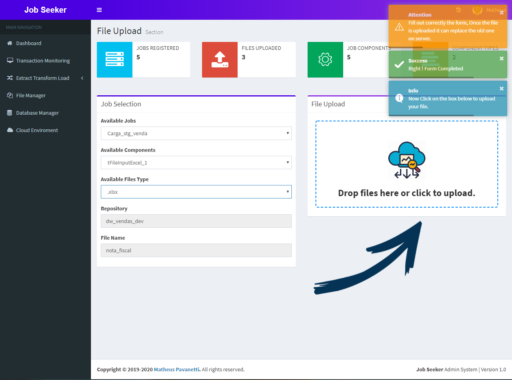
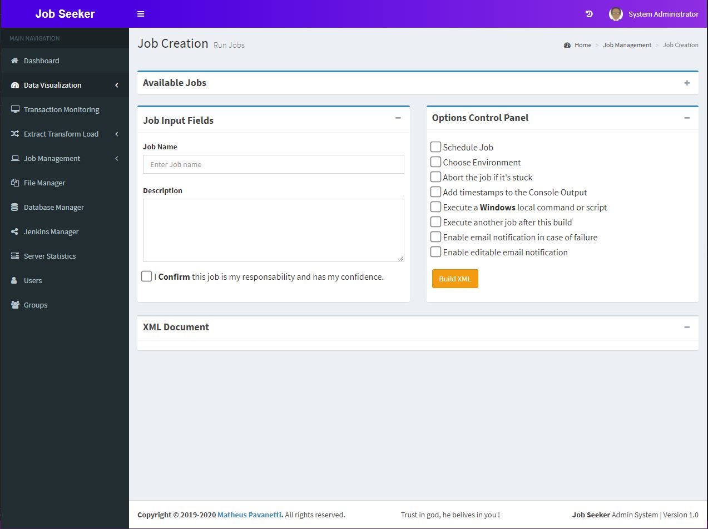
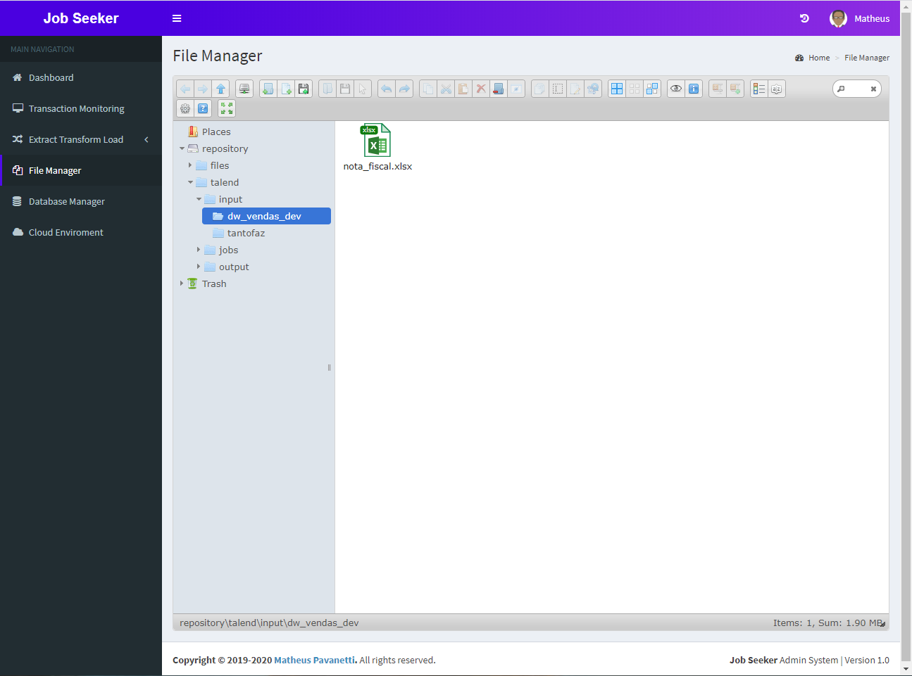
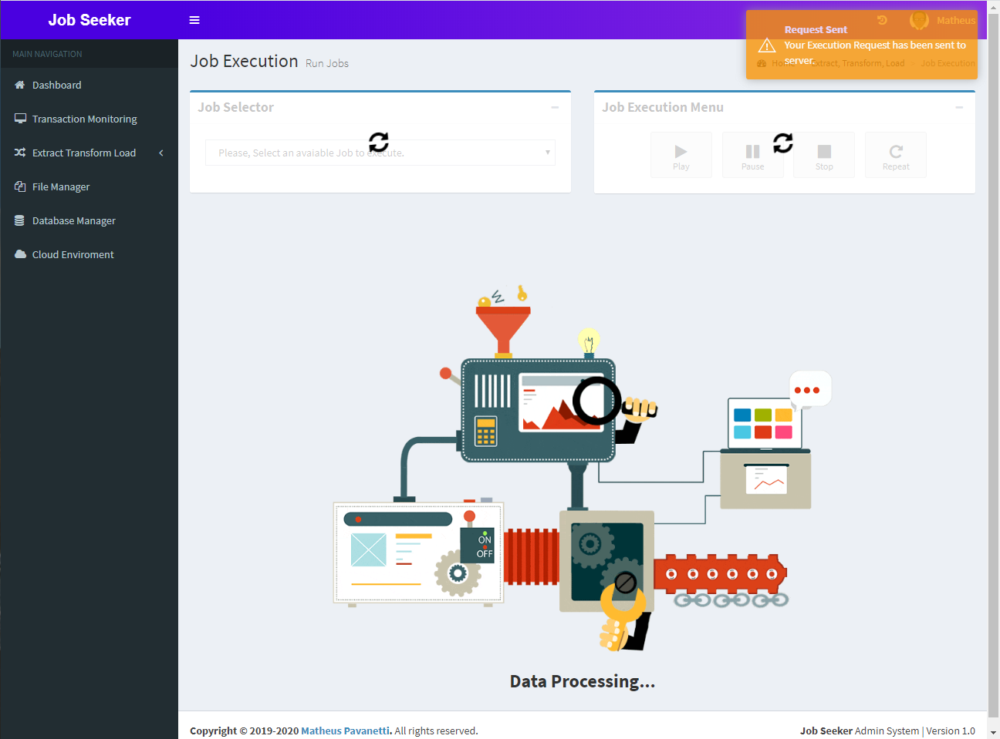
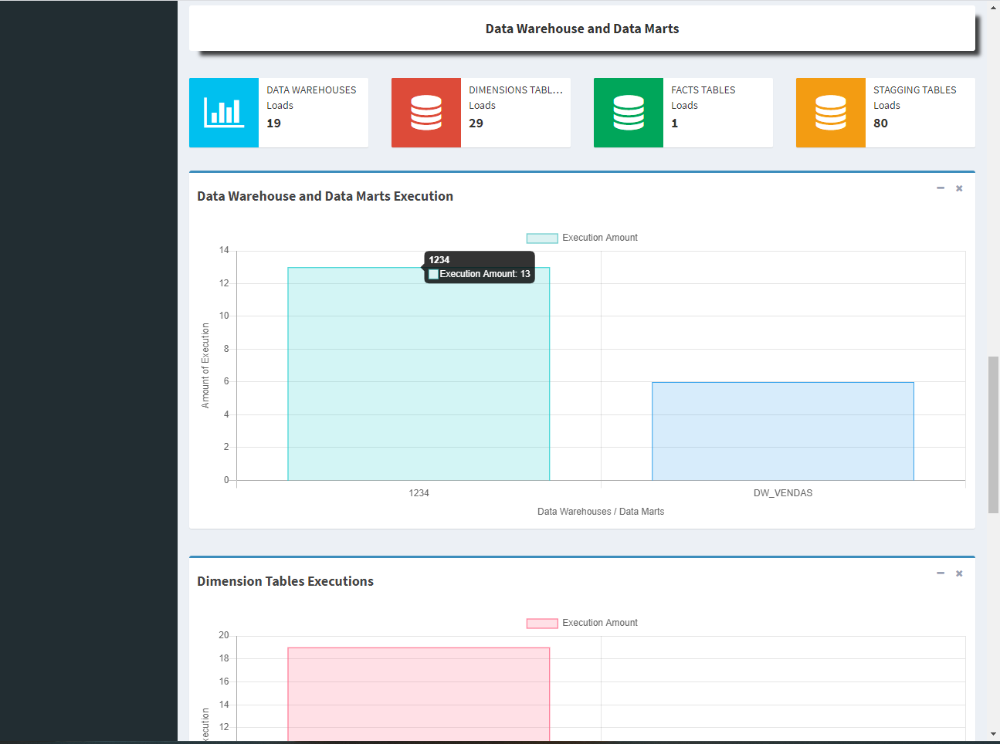
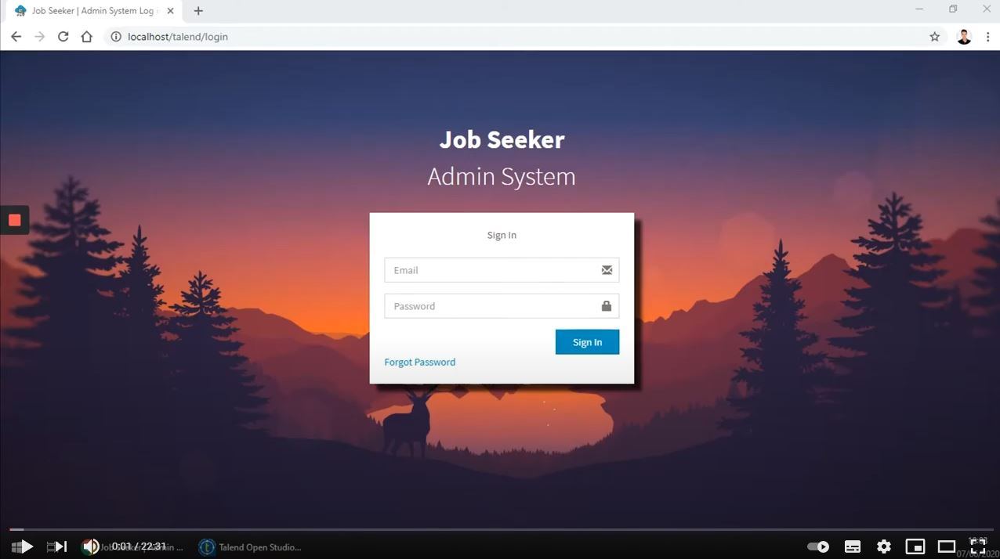
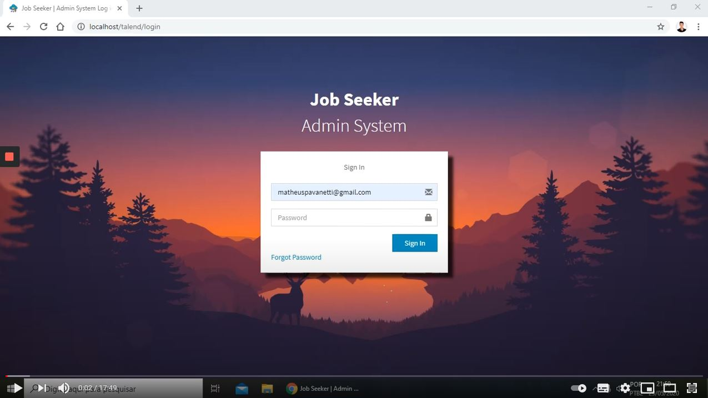

# JobSeeker Task Scheduler and logging framework
**Software acting as an iPaaS solution integrating a powerful task scheduler, logging framework, dashboards preview and much more.**

If you are looking for a tool which can provide you an unified platform with task job scheduler (Talend, Windows Batch Scripts, Linux Bash Scripts, Python Scripts, Spark Jobs, etc) and also a system which has a logging platform for querying your build status, get customized notifications on email, different user roles permissions, file management and more, this tool was designed for you !

**Purpose :**

This tool is a platform contaning a combination of task scheduler, job management, logging framework, transaction monitoring framework, file manager, different user role accesses that can be great integrated with a cloud provider. Monitoring your on prem and cloud integration job has been not easy, different systems uses their different logging and scheduler framework, with this tool you can centralize the task shceduler and logging into a single platform and more, you can also embebd your Power BI, Tableau, Qlik Sense dashboards on the system and have different user role accesses. This is great if you want to have a centralized environment on cloud for your integration flows for monitoring and scheduling them. 

## Features
1. Login, Logout.
2. Change Password, Forget Password.
3. Create, Update, Delete Users.
4. Predefined Roles (You can change roles and rights as per your project requirement).
5. Login history of Users.
6. Statistics reports and dashboards.
7. Transaction Monitoring Framework (TMF).
8. Query to your job logs.
9. Data Visualization area.
10. File and Folder input area for uploading your data into the cloud feeding your ETL Process.
11. Custom Database parameters to be called from an ETL job.
12. Custom Settings parameters to be called from an ETL job.
13. Email Settings for customize your email templates which you need to send once your ETL job finishes.
14. STMP setup for your ETL jobs.
15. Context Settings for your Talend,Python jobs, based on key value pairs.
16. Environment Settings.
17. Project Settings.
18. Job Build list.
19. Trigger multiple jobs at the same time.
20. Full job history build list.
21. View job details.
22. Create a build to manual run a job or run based on shedule and time interval, add parameters to your ETL job and much more.
23. Delete job and job files.
24. File Manager.
25. Database Manager.
26. Jenkins Manager.
27. Server Statistcs.
28. User Group Management.


## Version Information
**1) Latest (master) -** Beta Version Released.

## User Management

### Default User and Password Table

Role | Login | Password | Description 
--- | --- | --- |--- 
System Administrator | admin@example.com | 123456 | Admin User
Developer | developer@example.com | 123456 | Developer User
Key User | keyuser@example.com | 123456 | Key User 

<br>Remember to change the default user and password once you implement the system.

### Explaining the available roles:

**System Administrator**: This is an infrastructure system administrator, wich access of creating users, groups, granting permissions, acessing to jenkins manager, database manager, server statistics.<br>
**Developer**: A developer user has permissions to manage files, upload files, create job builds, query logs, adding data visualizations, view jobs, delete jobs, manage jobs, run jobs, schedule jobs, query jobs status and more.<br>
**Key User**: A Key User or also called as Business user has permissions to query job build logs, analyze job run history, check dashboard, check all kind of logs.

## Installation

**[Check Out]**: Download or git clone this repository into your http server.

**[MariaDB Database]**: You need a MySql(MariaDB) insntance for hosting the system tables, after you have it implemented, you need to setup the jobseeker config files with your infrastructure info.<br>
**[Run Create Table Database script]**: You can find the db setup script at [db_setup.sql](db_setup.sql).<br>
**[Setup Database connections with jobseeker]**: Navegate into your jobseeker root folder in the following path: **jobseeker/application/config/database.php**. Edit the file [database.php](application/config/database.php) with a text editor and scroll up to the end and find the database parameters as following:<br>
```
$db['default'] = array(
	'dsn'	=> '',
	'hostname' => 'localhost',
	'username' => 'root',
	'password' => 'YOURPASSWORD',
	'database' => 'jobseeker',
	'dbdriver' => 'mysqli',
	'dbprefix' => '',
	'pconnect' => FALSE,
	'db_debug' => (ENVIRONMENT !== 'production'),
	'cache_on' => FALSE,
	'cachedir' => '',
	'char_set' => 'utf8',
	'dbcollat' => 'utf8_general_ci',
	'swap_pre' => '',
	'encrypt' => FALSE,
	'compress' => FALSE,
	'stricton' => FALSE,
	'failover' => array(),
	'save_queries' => TRUE
);
```
**Note:** Change only the parameters **hostname, username, password, database**.
<br><br>


**[Jenkins]**: The jobseeker tool needs a jenkins instance to operate over build executions and crontab scheduler, it basically sends requests to jenkins through a http API and get fetch the results as an intermediator. This is an optional feature but if you don't install jenkins, the jobseeker tool will only act as a transaction logging framework.<br>
Click to access the [Jenkins Setup](doc/Jenkins).<br>
After Finishing up the Jenkins Setup, navigate into your jobseeker folder, find the file [config.json](application/config/config.json) at **jobseeker/ application/config/config.json** edit it using a text editor.
```
{
    "jenkins": {
        "enabled": true,
        "url": "http:\/\/localhost:8080\/",
        "username": "matheus",
        "token": "11883b9bbf07ade64064dc291d899c34cc",
        "authorization": "Basic",
        "jenkins_home": ""
    },
    "setup": {
        "enabled": false,
        "env": ""
    }
}
```
If you choose to use jenkins, which I recommend, change the enabled parameter to true, insert your jenkins url, username and token.<br>
If you are implementing the system in a docker container and your jenkins is also in a docker container, you can specify the jenkins home as your container mapping directory.
<br><br>

## Instructions and Use Cases

### Instructions 
1) [[Data Visualization Instructions]](doc/jobseeker/DataVisualization)
2) [[Transaction Monitoring]](doc/jobseeker/TransactionMonitoring)
3) [[Extract, Transform and Load. Helpers]](doc/jobseeker/ETL)
4) [[Job Management]](doc/jobseeker/JobManagement)
5) [[File Manager]](doc/jobseeker/FileManager)
6) [[Database Manager]](doc/jobseeker/DatabaseManager)
7) [[Users Management]](doc/jobseeker/Users)
8) [[Groups Management]](doc/jobseeker/Groups)

### Use Cases
1) [[Talend Data Integration Use Case]](doc/Talend)
2) [[Python Use Case]]() (Coming Soon)
3) [[Python Spark Use Case]]() (Coming Soon)
4) [[Windows Batch Script Use Case]]() (Coming Soon)
5) [[Linux Bash Script Use Case]]() (Coming Soon)

## Some Screenshots
Jobseeker Home:


<br>JobSeeker Transaction Monitoring - Query Builder:


<br>JobSeeker Transaction Monitoring:


<br>JobSeeker File Upload:


<br>JobSeeker Job Creation:


<br>JobSeeker File Manager:


<br>JobSeeker Transaction Job execution:


<br>JobSeeker DW and DM Dashboard:


<br>

## Youtube Videos
### English JobSeeker Demonstration Video:

[](https://www.youtube.com/watch?v=p9Qusad2Kc0&t)
<br>
<br>

### Brazilian Portuguese JobSeeker Demonstration Video:

[](https://www.youtube.com/watch?v=p9Qusad2Kc0&t)
<br>

<br>

## Credits
Matheus Pavanetti - 2021  
(matheuspavanetti@gmail.com)

## Contributors
New Contributors are always welcome !

## Notes
As this is a beta version, bugs may be found, if you find some, please report immediatly !