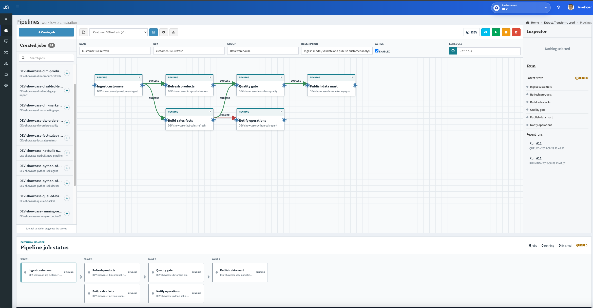

# JobSeeker

Self-hosted operations and orchestration for Jenkins-backed data jobs.

JobSeeker gives data teams one place to create, schedule, run, promote, and monitor ETL and batch workloads. It adds environment-aware controls, visual pipelines, runtime configuration, observability, and governed analytics around Jenkins without replacing Jenkins as the execution engine.

JobSeeker supports Python, Talend, shell, Docker, and other Jenkins-compatible workloads.

> **Project status:** beta. Use the default configuration for local evaluation only, and review the security guidance before deploying to a shared environment.

## Capabilities

### Job operations

- Create and manage Jenkins jobs through guided forms for Python, Talend, Linux shell, and Windows command workloads.
- Load curated simple, intermediate, and advanced shell or Python starters into the active execution editor, including multi-file JobSeeker SDK workspaces and database-connector ETL jobs that run out of the box.
- Save multiple browser-cached job drafts, compare their configuration, duplicate them, and chain drafts before creating jobs.
- Run jobs immediately or schedule one-time, recurring, tag-based, and custom Jenkins cron triggers.
- Send templated email notifications for successful, failed, and aborted builds.
- Map the connectors and data assets a job's code uses, check their catalog status, and run a real connection test at creation.
- Inspect queue state, build history, worker assignment, grouped console output, Python test stages, and Docker resource usage.

### Visual pipelines

- Build validated directed acyclic graphs by dragging existing Jenkins jobs onto a canvas.
- Run independent jobs in parallel and model sequential, fan-in, recovery, `SUCCESS`, `FAILURE`, and `ALWAYS` paths.
- Schedule pipelines, monitor each node live, inspect node console output, and stop active runs.
- Synchronize pipeline definitions with Jenkins and deploy them between environments.

### Environments and promotion

- Keep job creation, execution, monitoring, TMF, pipelines, and analytics aligned through a global environment selector.
- Promote jobs and pipelines with dependency discovery, context-variable handling, artifact copying, and dry-run previews.
- Compare environments, inspect promotion history, and restore rollback checkpoints.
- Route workloads to optional environment-specific Jenkins agents and apply per-environment trigger limits.

### Data runtime

- Use the bundled Python `jobseeker` SDK for TMF logging, context lookup, progress reporting, Data Asset discovery, and connector access.
- Publish environment-aware Data Assets behind stable `jobseeker://` URIs for Python, shell, Talend, and Docker jobs.
- Resolve named ETL connectors by environment and job scope from encrypted local values, worker variables, Azure Key Vault, or AWS Secrets Manager.
- Open inline Docker Python jobs as full projects in the bundled OpenVSCode Server with Poetry, uv, Ruff, mypy, BasedPyright, pytest, coverage, and debugpy.
- Gate Python execution with pytest and keep test output separate from application output in the Jenkins console.

### Monitoring and analytics

- Monitor running, queued, successful, failed, disabled, and not-built Jenkins jobs from operational dashboards.
- Query Transaction Monitoring Framework (TMF) history by job, status, environment, time range, dimension, event, and reprocessing state.
- Track processed records, completion, warnings, errors, messages, runtime, host, and user metadata.
- Store all time in UTC and switch any screen's timestamps between UTC and the viewer's local time with a per-browser toggle.
- Build private or shared dashboards in Insight Studio using governed application datasets or approved database tables.
- Publish sandboxed Power BI, Tableau, Qlik, Superset, Metabase, Grafana, and other external BI reports with user and group access rules.

### Administration

- Manage users, roles, projects, environments, context variables, uploads, SMTP, email templates, and runtime settings.
- Monitor Jenkins executors, environment slots, worker nodes, Docker containers, images, volumes, and job resource usage.
- Deploy the control plane on Kubernetes, autoscale the stateless web tier, and launch isolated Jenkins agent pods on demand per environment.

## Quick Start

### Requirements

- Git
- Docker Engine
- Docker Compose v2

Clone the repository, create a local environment file, and start the stack:

```bash
git clone https://github.com/mpavanetti/jobseeker.git
cd jobseeker
cp .env.example .env
docker compose up -d --build
```

The first start builds the application and Jenkins images, restores frontend assets, initializes MariaDB, and waits for the services to become healthy.

For non-Docker jobs on smaller development machines, use the lightweight override. It keeps Jenkins scheduling but omits Docker-in-Docker, Docker monitoring, and OpenVSCode until requested:

```bash
docker compose -f docker-compose.yml -f docker-compose.light.yml up -d --build
```

For a clustered deployment, the [Kubernetes guide](deploy/kubernetes/README.md)
provides Kustomize resources, namespace-scoped RBAC, HPA/PDB policies, shared
repository storage, Kubernetes-managed OpenVSCode, and dynamic Jenkins agents.

### Deployment modes

The default `multi` mode is the current all-in-one control plane: DEV, QA, UAT,
PROD, and any custom environments share the application, database, Jenkins,
global environment selector, and promotion workflow.

For regulated or independently operated environments, use `standalone` mode.
Each installation has one immutable environment scope, its own data and
secrets, and one matching worker pool. Browser parameters, cookies, connector
requests, and job forms cannot broaden that scope. Cross-environment promotion
buttons are removed; promote the same reviewed release through the separately
managed deployments instead.

Start a standalone Compose installation like this:

```bash
export JOBSEEKER_STANDALONE_ENVIRONMENT=PROD
docker compose -p jobseeker-prod \
  -f docker-compose.yml -f docker-compose.standalone.yml \
  up -d --build
```

Use a different host or checkout, persistent storage, Compose project name,
ports, credentials, encryption key, connector token, and editor token for each
environment. Existing databases are supported: the configured environment is
created/activated when needed, while records for other environments are left
untouched and inaccessible until the installation returns to `multi` mode.

Service | Default URL
--- | ---
JobSeeker | http://localhost/
Jenkins | http://localhost:8080/login
Mailpit | http://localhost:8025/
OpenVSCode Server | http://localhost:3000/ (normally opened from a job's **Code** action)

Use `JOBSEEKER_HTTP_PORT`, `JENKINS_HTTP_PORT`, `JOBSEEKER_MAILPIT_HTTP_PORT`, or `JOBSEEKER_OPENVSCODE_PORT` in `.env` when a default port is already in use.

### Default access

JobSeeker role | Login | Password
--- | --- | ---
System Administrator | `admin@example.com` | `123456`
Developer | `developer@example.com` | `123456`
Key User | `keyuser@example.com` | `123456`

Jenkins login | Password
--- | ---
`jobseeker` | `jobseeker`

> **Important:** change all default passwords, `JOBSEEKER_ENCRYPTION_KEY`, `JOBSEEKER_CONNECTOR_API_TOKEN`, and `JOBSEEKER_OPENVSCODE_TOKEN` before shared or production use. Terminate TLS at a trusted reverse proxy and set secure cookie options for HTTPS deployments.

## Demo Data

Populate Jenkins and MariaDB with representative jobs, build states, TMF history, connected reports, and Insight Studio dashboards:

```bash
./seed_demo_data.sh
```

The seed includes successful, failed, running, queued, disabled, and not-built jobs, plus Python SDK examples for Jenkins-agent and Docker execution.

Job Creation also has a **Load Sample** library for reviewed shell and Python starters. Samples can be filtered by runtime, complexity, or platform integration, including TMF tracking, Context Settings, Data Assets, scoped connectors, the built-in database connector, pipelines, email metrics, Docker, and tests. Every sample is POSIX-`sh` safe and runs on a fresh stack with nothing pre-provisioned: connector samples resolve the seeded `jobseeker-mariadb` connector, and samples that can use a governed Data Asset or Context value degrade with an actionable hint when one is not registered. The database ETL workspace and the platform pipeline combine these contracts in one adaptable JobSeeker job; loading a sample never saves or executes it automatically.

Remove the seeded dataset with:

```bash
./seed_demo_data.sh --cleanup
```

Customize a demo run with environment variables:

```bash
DEMO_PREFIX=showcase DEMO_SLEEP_SECONDS=1200 DEMO_BLOCKER_COUNT=5 ./seed_demo_data.sh
```

### Performance datasets

Administrators can open **Dataset Generator** in the sidebar to create a named, seeded batch of TMF history, TMF errors, job identities, end-to-end pipeline definitions, and pipeline run history. Quick, performance, and stress profiles can be overridden, report database rows/second, and can optionally create matching Jenkins samples spanning runtime diagnostics, TMF/context, Data Assets, connectors, and pipeline-ready workloads without triggering them. Removing a batch deletes only records registered to that batch.

The same generator is available for CI or repeatable profiling. It is a dry run unless `--apply` is present:

```bash
python3 scripts/generate-performance-dataset.py seed \
  --profile performance --batch-key perf-ci

python3 scripts/generate-performance-dataset.py seed \
  --profile performance --batch-key perf-ci --jenkins --apply

python3 scripts/generate-performance-dataset.py cleanup \
  --batch-key perf-ci --apply
```

Use `--tmf-rows`, `--jobs`, `--pipelines`, `--pipeline-runs`, `--environments`, and `--seed` for a custom workload. Stress profiles are intended for disposable performance-test environments.

## Configuration

[.env.example](.env.example) documents the complete local configuration. The most important settings are:

Variable | Purpose
--- | ---
`JOBSEEKER_DEPLOYMENT_MODE` | Chooses `multi` (default) or the server-enforced `standalone` topology.
`JOBSEEKER_STANDALONE_ENVIRONMENT` | Mandatory environment name for a standalone installation, such as `DEV` or `PROD`.
`JOBSEEKER_ENCRYPTION_KEY` | Encrypts application-managed secrets and governed data-source credentials.
`JOBSEEKER_DB_PASSWORD` / `JOBSEEKER_MYSQL_ROOT_PASSWORD` | Protect the application and root database accounts.
`JENKINS_ADMIN_PASSWORD` | Configures the Jenkins account used by JobSeeker's server-side proxy.
`JOBSEEKER_CONNECTOR_API_TOKEN` | Authenticates build workers when resolving scoped connectors.
`JOBSEEKER_JENKINS_DEFAULT_ENVIRONMENT_SLOTS` | Sets the default application-side concurrent trigger limit per environment.
`JOBSEEKER_JENKINS_ENVIRONMENT_SLOTS` | Overrides limits by environment, for example `DEV=2,QA=1,PROD=2`.
`JOBSEEKER_OPENVSCODE_TOKEN` | Protects the browser-based Python workspace.
`JOBSEEKER_OPENVSCODE_IDLE_TIMEOUT_MINUTES` | Stops an unused editor automatically; use `0` to keep it running.
`JOBSEEKER_OPENVSCODE_CONTINUE_ENABLED` | Adds the optional Continue local-AI extension to the OpenVSCode image.
`JOBSEEKER_TMF_RESULT_LIMIT` | Bounds the newest TMF rows rendered in one response (default 1,000, maximum 10,000).
`JOBSEEKER_TIMEZONE` | The app always stores and computes time in UTC; this only sets which side of the per-browser UI timezone toggle a first-time viewer starts on (`UTC` by default, or any PHP timezone identifier to start on local time).
`JOBSEEKER_COMMAND_GUARD_ENFORCE` | When `true`, a critical/high `CommandGuard` finding blocks job creation instead of only warning.

Connector values for local workers can be placed in an ignored `.env.connectors` file based on [.env.connectors.example](.env.connectors.example).

### Optional environment agents

The default stack runs jobs on the Jenkins controller. To route jobs to environment-specific inbound agents, enable routing in `.env`:

```bash
JOBSEEKER_JENKINS_ENVIRONMENT_AGENTS_ENABLED=true
```

Then start the required workers. A small local setup usually needs only DEV and QA:

```bash
docker compose --profile jenkins-agents up -d --build \
  jenkins-agent-dev jenkins-agent-qa
docker compose up -d --force-recreate php
```

Jenkins executors control how many builds a node can run. JobSeeker environment slots control how many JobSeeker-triggered builds can enter Jenkins for each environment. Neither setting reserves CPU or memory, so size both for the available host capacity.

## Architecture

JobSeeker is a CodeIgniter 3 application backed by MariaDB and Jenkins.

Component | Responsibility
--- | ---
Nginx | Serves the web application and routes PHP requests.
PHP-FPM | Runs JobSeeker, authorization, configuration, orchestration, and API proxy logic.
MariaDB | Stores users, settings, contexts, pipeline definitions, TMF records, and analytics metadata.
Jenkins | Schedules jobs and pipelines, retains history and console output, and can create disposable Kubernetes agents for execution.
Docker runtime | Builds and runs isolated Docker workloads without exposing its daemon directly to the application.
OpenVSCode Server | Provides full project workspaces for inline Docker Python jobs.
Mailpit | Captures local email notifications during development and evaluation.

Browser requests to Jenkins pass through an authenticated server-side proxy. Jenkins credentials and connector secrets are not sent to the browser. Pipeline definitions compile to hidden Jenkins Pipeline jobs, so Jenkins remains the durable scheduler and execution engine.

## Security Model

- Role-based access controls protect administrative and job-management actions.
- CSRF validation covers application mutations and proxied Jenkins mutations.
- Operator-authored job commands are screened at creation for destructive and exfiltration patterns (`CommandGuard`); findings are advisory by default and become blocking with `JOBSEEKER_COMMAND_GUARD_ENFORCE=true`. This is a guard rail, not a sandbox - see [doc/jobseeker/Security/command-hardening.md](doc/jobseeker/Security/command-hardening.md) for the container controls that contain a hostile job.
- Connector secrets are resolved only when a build starts, scoped by environment and job, materialized in protected temporary files, and removed after execution.
- Insight Studio resolves datasets and fields through server-side allowlists; it does not expose arbitrary SQL or database credentials to the browser.
- Connected BI reports are rebuilt into restricted iframe elements with sandbox and referrer controls.

The bundled defaults are intended for local development. Production deployments still require unique secrets, HTTPS, network policy, backups, least-privilege external accounts, and an appropriate Jenkins worker topology.

## Documentation

Topic | Guide
--- | ---
Documentation index | [doc/README.md](doc/README.md)
Job management | [doc/jobseeker/JobManagement/README.md](doc/jobseeker/JobManagement/README.md)
Visual pipelines | [doc/jobseeker/ETL/pipelines/README.md](doc/jobseeker/ETL/pipelines/README.md)
Security model and hardening | [doc/jobseeker/Security/README.md](doc/jobseeker/Security/README.md)
Job command hardening | [doc/jobseeker/Security/command-hardening.md](doc/jobseeker/Security/command-hardening.md)
Data Assets | [doc/jobseeker/ETL/data-assets/README.md](doc/jobseeker/ETL/data-assets/README.md)
ETL connectors | [doc/jobseeker/ETL/connectors/README.md](doc/jobseeker/ETL/connectors/README.md)
Transaction Monitoring Framework | [doc/jobseeker/TransactionMonitoring/README.md](doc/jobseeker/TransactionMonitoring/README.md)
Insight Studio and connected BI | [doc/jobseeker/DataVisualization/README.md](doc/jobseeker/DataVisualization/README.md)
Python ETL | [doc/Python/README.MD](doc/Python/README.MD)
Lightweight runtime assessment | [doc/jobseeker/Architecture/lightweight-runtime.md](doc/jobseeker/Architecture/lightweight-runtime.md)
Kubernetes deployment and scaling | [deploy/kubernetes/README.md](deploy/kubernetes/README.md)
Talend ETL | [doc/Talend/README.md](doc/Talend/README.md)
Jenkins notes | [doc/Jenkins/README.md](doc/Jenkins/README.md)

## Screenshots

### Operations dashboard


### Transaction monitoring


### Pipelines



### Job creation


### Job and build monitoring


### Job execution


## Video Demos

[](https://www.youtube.com/watch?v=p9Qusad2Kc0&t)

[](https://www.youtube.com/watch?v=Pms98qTvfA0)

## Development Checks

Validate Compose configuration and run the focused JavaScript regression suite:

```bash
docker compose config --quiet
npm ci
npm test
```

Docker Compose restores generated frontend assets automatically. To refresh them manually:

```bash
docker compose run --rm assets
```

Issues and pull requests with reproducible details are welcome.

## Maintainer

[Matheus Pavanetti](https://www.linkedin.com/in/matheuspavanetti/)
