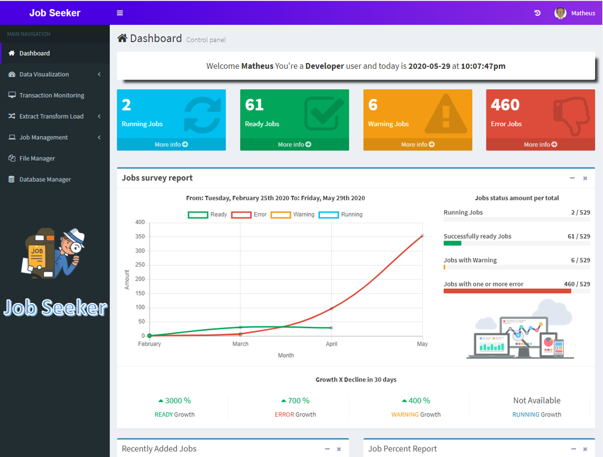
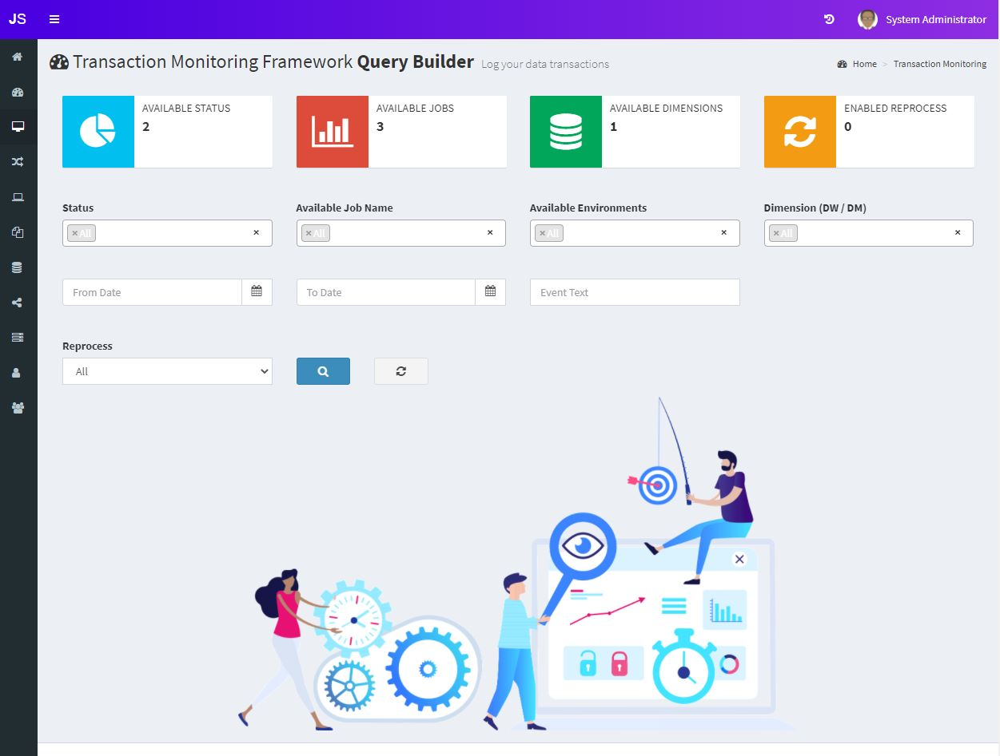
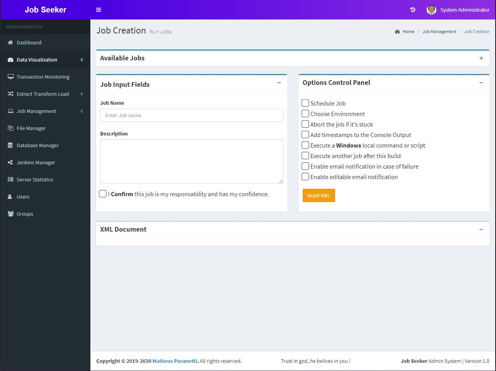
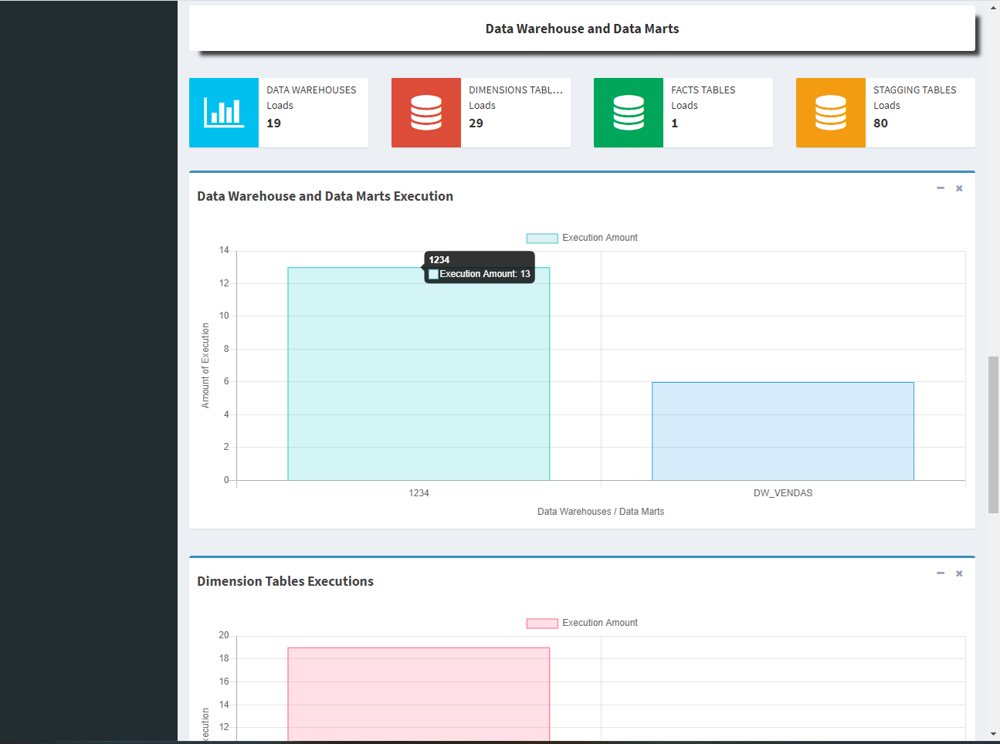

# JobSeeker - Jenkins ETL Job Scheduler and Data Pipeline Monitoring Portal

JobSeeker is a self-hosted web portal for Jenkins-backed ETL operations.

Use it to create Jenkins jobs, schedule ETL jobs, trigger pipelines, monitor executions, inspect logs, manage runtime configuration, and publish operational dashboards.

It combines a Jenkins job scheduler, Transaction Monitoring Framework (TMF), ETL helper screens, role-based access, file management, database utilities, and embedded BI dashboards.

Search keywords:
- open source ETL job scheduler
- Jenkins job orchestration
- data pipeline monitoring
- Talend job scheduler
- Python ETL scheduler
- Transaction Monitoring Framework
- CodeIgniter Jenkins dashboard

## What JobSeeker Solves

Data engineering and integration teams often need more than cron entries or a Jenkins job list.

They need searchable run history, environment context, failure details, processed-record counts, runtime parameters, and access control.

JobSeeker centralizes this into a web UI:

- Create, schedule, run, stop, view, and delete Jenkins-backed jobs.
- Upload job packages and scripts into a managed repository structure.
- Monitor job status, build history, console output, errors, warnings, and processed record counts.
- Store reusable database settings, SMTP settings, email templates, file paths, parameters, and environment-specific contexts.
- Query TMF logs by job, status, environment, date range, dimension, event text, and reprocess flag.
- Embed Power BI, Tableau, Qlik Sense, and other dashboards with user and group-level access control.
- Manage users, groups, roles, login history, file access, server statistics, and database tools.

## Common Use Cases

- Open source ETL job scheduler for Talend, Python, Bash, and Windows Batch workloads.
- Jenkins job orchestration portal for data pipeline execution and monitoring.
- Data integration monitoring tool with searchable logs and execution history.
- Centralized runtime configuration store for ETL contexts, database connections, file paths, email templates, and environment variables.
- Self-hosted ETL operations portal for on-premise or cloud-hosted batch workflows.
- Operational dashboard hub for data warehouse, data mart, BI, and batch processing teams.

## Core Capabilities

### Job Scheduling and Execution

- Create or edit Jenkins jobs from the JobSeeker UI.
- Save jobs, update existing Jenkins job configuration, or save and trigger a build immediately.
- Trigger one or many jobs manually from the job management screens.
- Schedule jobs with execution parameters and environment selection.
- View build lists, full build history, job details, console logs, and execution results.
- Abort stuck jobs and configure timeout behavior.
- Delete jobs and related job files when they are no longer needed.
- Run Python jobs from a single `.py` upload, a ZIP package, an existing repository path, or a Git repository URL with an entry Python file.

### Transaction Monitoring Framework

- Log job starts, ready states, errors, warnings, messages, and custom HTML output.
- Query job transactions by environment, status, job name, date range, dimension, and reprocess flag.
- Inspect job messages and exception details from the UI.
- Track total records and processed records for ETL and batch workloads.

### ETL Helpers and Runtime Configuration

- Manage input and output components.
- Store database connection settings for jobs.
- Store generic key-value settings used by external ETL scripts.
- Maintain SMTP settings and reusable email templates.
- Define projects, environments, and context key-value pairs for Talend and Python jobs.
- Change runtime values centrally without rebuilding every job package.

### Dashboards, Files, and Administration

- Embed Power BI, Tableau, Qlik Sense, and iframe-based reports.
- Restrict reports by user and group.
- Upload and manage job files through the file manager.
- Use database manager and server statistics screens for administration.
- Manage users, groups, predefined roles, profiles, password changes, and login history.

## Architecture

JobSeeker is a CodeIgniter 3 PHP application backed by MariaDB. The Docker stack starts:

- Nginx for the web server.
- PHP-FPM for the application runtime.
- MariaDB for JobSeeker metadata, TMF logs, users, settings, and contexts.
- Jenkins for job execution, scheduling, build history, console output, and job control.

In the Docker installation, JobSeeker talks to Jenkins through an authenticated server-side proxy.

The browser does not need Jenkins API credentials, and local Docker usage does not need manual Jenkins CORS setup.

## Version Information

Latest branch: `master` beta release.

## Default Users

Role | Login | Password | Description
--- | --- | --- | ---
System Administrator | admin@example.com | 123456 | Full administration access
Developer | developer@example.com | 123456 | Job, file, ETL, dashboard, and monitoring access
Key User | keyuser@example.com | 123456 | Monitoring, dashboard, and log analysis access

Change the default users and passwords before using JobSeeker in a shared or production environment.

## Roles

- **System Administrator**: platform administration, users, groups, permissions, Jenkins, database tools, and server statistics.
- **Developer**: job creation, uploads, execution, scheduling, logs, dashboards, deletion, and status checks.
- **Key User**: build logs, job run history, dashboards, and operational status checks.

## Quick Start With Docker

Make sure Docker and Docker Compose are installed.

Clone the repository and start the full stack:
```
git clone https://github.com/mpavanetti/jobseeker.git
cd jobseeker

docker compose up -d --build
```

Access to JobSeeker UI: http://localhost/  

Access Jenkins UI: http://localhost:8080/  
User: jobseeker   
Pass: jobseeker

The Docker stack configures the database connection, session encryption key, and internal Jenkins API endpoint through [docker-compose.yml](docker-compose.yml).

Browser links still open Jenkins at http://localhost:8080/.

For shared environments, set real values before starting the stack:
```
export JOBSEEKER_ENCRYPTION_KEY="replace-with-a-long-random-secret"
export JOBSEEKER_DB_PASSWORD="replace-with-a-database-password"
export JOBSEEKER_MYSQL_ROOT_PASSWORD="replace-with-a-root-password"
export JENKINS_ADMIN_PASSWORD="replace-with-a-jenkins-password-or-token"
export JENKINS_NUM_EXECUTORS="5"

docker compose up -d --build
```

No manual Jenkins CORS setup is required for Docker. Jenkins is provisioned by the image, and JobSeeker sends API requests through the authenticated server-side proxy.

Jenkins parallelism is controlled by `JENKINS_NUM_EXECUTORS`. The default Docker setup uses 5 executors, so independent jobs can run at the same time.

Adminer, elFinder, and server statistics tools are disabled in Docker because they expose administration surfaces outside the main JobSeeker authorization flow.

Docker Compose is the recommended installation path because it starts the application, database, and Jenkins execution engine together.

## Documentation and Use Cases

### Product Documentation

1. [Data Visualization](doc/jobseeker/DataVisualization)
2. [Transaction Monitoring Framework](doc/jobseeker/TransactionMonitoring)
3. [ETL Helpers and Runtime Configuration](doc/jobseeker/ETL)
4. [Job Management](doc/jobseeker/JobManagement)
5. [File Manager](doc/jobseeker/FileManager)
6. [Database Manager](doc/jobseeker/DatabaseManager)
7. [Users Management](doc/jobseeker/Users)
8. [Groups Management](doc/jobseeker/Groups)

### Example Implementations

1. [Talend Data Integration Use Case](doc/Talend)
2. [Python ETL Use Case](doc/Python)
3. [Windows Batch Script Use Case](doc/batch)
4. [Linux Bash Script Use Case](doc/bash)

## Screenshots

JobSeeker home:



Transaction Monitoring query builder:



Job creation:



Operational dashboard:



## YouTube Videos
### English JobSeeker Demonstration Video:

[](https://www.youtube.com/watch?v=p9Qusad2Kc0&t)

### Brazilian Portuguese JobSeeker Demonstration Video:

[](https://www.youtube.com/watch?v=Pms98qTvfA0)

## Credits
Matheus Pavanetti
(matheuspavanetti@gmail.com)

## Contributors
New contributors are always welcome.

## Notes
As this is a beta version, bugs may be found. If you find some, please report them immediately.
Thanks