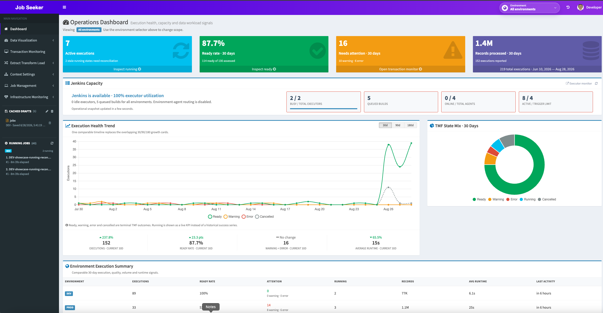
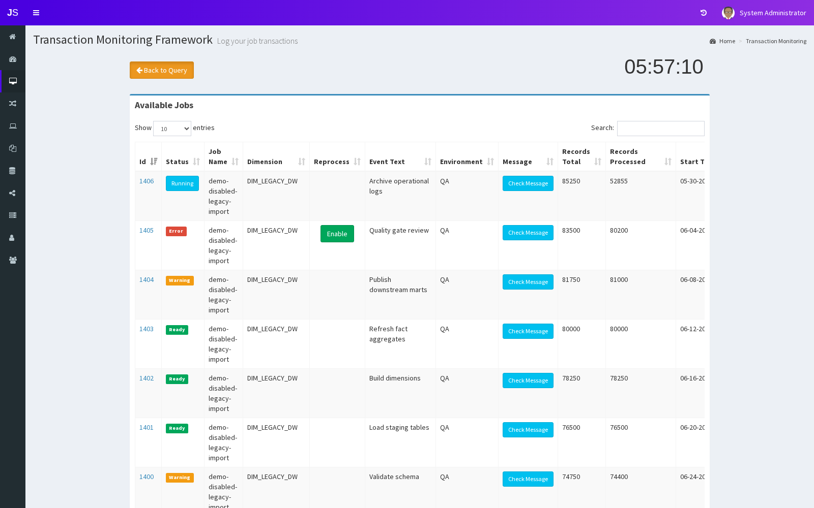
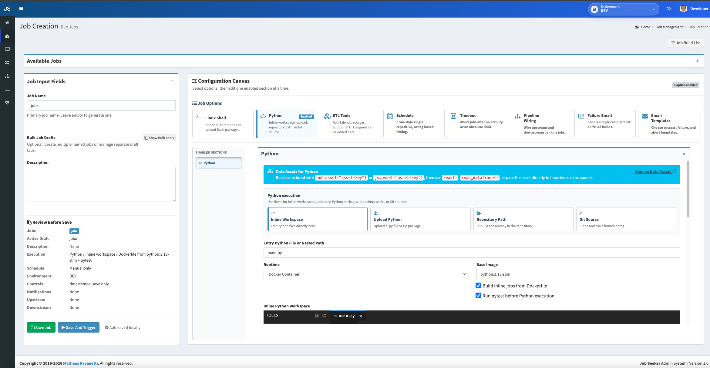
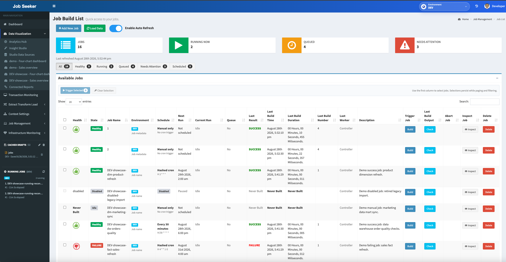
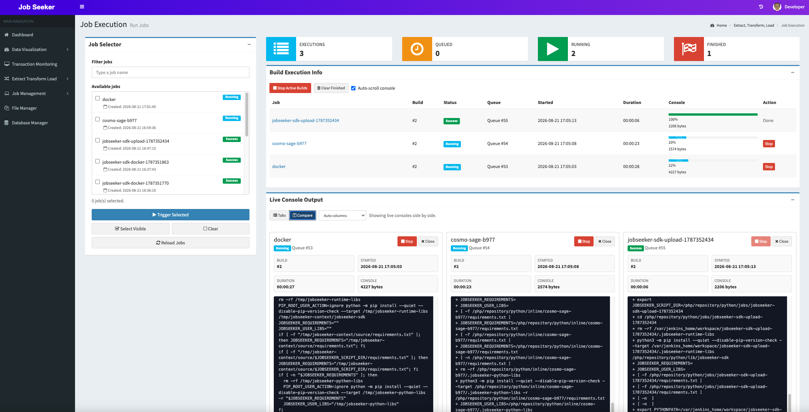
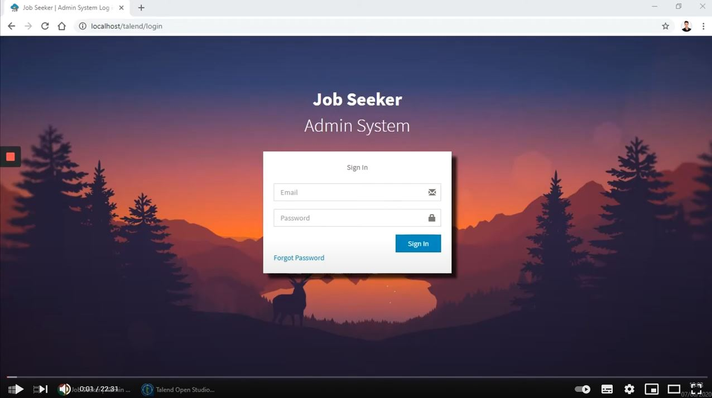
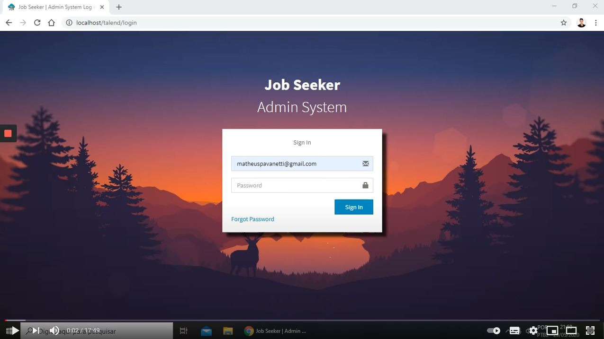

# JobSeeker

Jenkins ETL scheduler and data pipeline monitoring portal.

JobSeeker is a self-hosted operations portal for Jenkins-backed ETL and batch jobs.

It gives data teams one place to create and trigger Jenkins jobs, schedule recurring runs, monitor execution status, inspect logs, query Transaction Monitoring Framework (TMF) history, and manage runtime configuration for Talend, Python, Bash, and other workloads.

## Highlights

- Create, update, schedule, trigger, stop, inspect, and delete Jenkins jobs from a controlled web UI.
- Monitor running, queued, successful, failed, disabled, and not-built jobs with Jenkins build history and console output.
- Query TMF records by job, status, environment, date range, dimension, event text, and reprocess flag.
- Run Python jobs with the bundled `jobseeker` SDK for TMF logging, context lookup, progress updates, and Jenkins-agent or Docker execution.
- Track processed records, warnings, errors, messages, hostnames, users, and execution timing.
- Manage database settings, generic key-value settings, SMTP settings, email templates, file paths, projects, environments, and context variables.
- Publish embedded Power BI, Tableau, Qlik Sense, or iframe dashboards with user and group access control.
- Manage users, roles, uploads, runtime settings, and operational dashboards from the same portal.

## Architecture

JobSeeker is a CodeIgniter 3 PHP application backed by MariaDB and Jenkins.

The Docker stack includes:

- Nginx for the web server.
- PHP-FPM for the application runtime.
- MariaDB for JobSeeker metadata, TMF logs, users, settings, and contexts.
- Jenkins for job execution, scheduling, build history, console output, and job control.

In Docker, JobSeeker sends Jenkins API requests through an authenticated server-side proxy. The browser does not need Jenkins API credentials, and local Docker usage does not require manual Jenkins CORS setup.

## Project Status

Latest branch: `master` beta release.

## Default Access

### JobSeeker users

Role | Login | Password | Description
--- | --- | --- | ---
System Administrator | admin@example.com | 123456 | Full administration access
Developer | developer@example.com | 123456 | Job, file, ETL, dashboard, and monitoring access
Key User | keyuser@example.com | 123456 | Monitoring, dashboard, and log analysis access

### Jenkins user

Login | Password
--- | ---
jobseeker | jobseeker

Change the default users and passwords before using JobSeeker in a shared or production environment.

## Quick Start With Docker

Make sure Docker and Docker Compose are installed.

Clone the repository and start the full stack:
```bash
git clone https://github.com/mpavanetti/jobseeker.git
cd jobseeker

docker compose up -d --build
```

For local overrides, copy the environment template first:

```bash
cp .env.example .env
```

Open JobSeeker at http://localhost/ and Jenkins at http://localhost:8080/.

The Docker stack configures the database connection, session encryption key, and internal Jenkins API endpoint through [docker-compose.yml](docker-compose.yml).

For shared environments, set real values before starting the stack:
```bash
export JOBSEEKER_ENCRYPTION_KEY="replace-with-a-long-random-secret"
export JOBSEEKER_DB_PASSWORD="replace-with-a-database-password"
export JOBSEEKER_MYSQL_ROOT_PASSWORD="replace-with-a-root-password"
export JENKINS_ADMIN_PASSWORD="replace-with-a-jenkins-password-or-token"
export JENKINS_NUM_EXECUTORS="5"

docker compose up -d --build
```

Jenkins parallelism is controlled by `JENKINS_NUM_EXECUTORS`. The default Docker setup uses 5 executors, so independent jobs can run at the same time.

Docker Compose is the recommended installation path because it starts the application, database, and Jenkins execution engine together.

### Runtime Stack

- PHP-FPM 8.3 with the required MySQL and ZIP extensions.
- Nginx 1.29 Alpine serving the CodeIgniter application.
- MariaDB 10.7 for JobSeeker and TMF data.
- Jenkins 2.568.2 LTS with pinned plugins, Docker CLI access, and the JobSeeker Python SDK runtime.

Frontend assets are managed with npm in [package.json](package.json) and [package-lock.json](package-lock.json). The application still serves legacy AdminLTE 2, Bootstrap 3, and jQuery-era paths under `assets/bower_components`, but that directory is generated and is not committed.

Docker Compose restores those assets automatically through the `assets` service before Nginx starts. To refresh them manually, run:

```bash
docker compose run --rm assets
```

## Demo Data

After the Docker stack is running, seed Jenkins and MariaDB with representative demo data:

```bash
./seed_demo_data.sh
```

The seed creates Jenkins jobs with successful, failed, disabled, not-built, running, and queued states. It also creates Python SDK sample jobs for Jenkins-agent and Docker execution, then inserts TMF rows across past dates, statuses, dimensions, environments, warnings, and errors.

Remove the demo dataset with:

```bash
./seed_demo_data.sh --cleanup
```

Useful overrides:

```bash
DEMO_PREFIX=showcase DEMO_SLEEP_SECONDS=1200 DEMO_BLOCKER_COUNT=5 ./seed_demo_data.sh
```

## Documentation and Use Cases

### Product Documentation

1. [Data Visualization](doc/jobseeker/DataVisualization)
2. [Transaction Monitoring Framework](doc/jobseeker/TransactionMonitoring)
3. [ETL Helpers and Runtime Configuration](doc/jobseeker/ETL)
4. [Job Management](doc/jobseeker/JobManagement)
5. [Jenkins Setup Notes](doc/Jenkins)

### Example Implementations

1. [Talend Data Integration Use Case](doc/Talend)
2. [Python ETL Use Case](doc/Python)

## Screenshots

Dashboard with Jenkins and TMF status:



Transaction Monitoring records:



Job creation and available jobs:



Job build list:



Job execution workspace:



## Videos

English JobSeeker demonstration:

[](https://www.youtube.com/watch?v=p9Qusad2Kc0&t)

Brazilian Portuguese JobSeeker demonstration:

[](https://www.youtube.com/watch?v=Pms98qTvfA0)

## Credits

Matheus Pavanetti
(maintainer@example.com)

## Contributors

New contributors are always welcome.

## Notes

JobSeeker is currently beta software. Please report bugs with enough detail to reproduce the issue.
