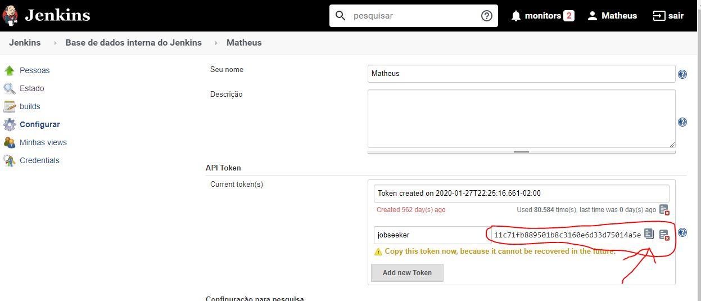

## Jenkins

### Jenkins is an optional feature for jobseeker, hence if you don't install jenkins you'll have a limited system usabillity.
 
Jenkins is a free and open source automation server. It helps automate the parts of software development related to building, testing, and deploying, facilitating continuous integration and continuous delivery. It is a server-based system that runs in servlet containers such as Apache Tomcat.
  

For more information Access the [Jenkins Webpage](https://www.jenkins.io/)

## Download and install Jenkins into your infrastructure
You can have jenkins wherever you want, I personally recommend cloud instances always.
[Download Jenkins](https://www.jenkins.io/download/)

## Activate jenkins user token
### User tokens are needed for the jenkins remote api usage.
After you have downloaded and installed jenkins completely into your infrastructure , it's time to install some plugins and enable http cors, and create a token.  

### Installing jenkins additional Plugins
Login into your jenkins instance, go to **Manage Jenkins**, go to **plugins**. 
Make sure the plugin "Authentication Tokens API" is installed, if not, install it.

  

Install the plugin CORS support for Jenkins

Reboot Jenkins after installing the plugins.

### Setting up Cors Support

Login into your jenkins instance, go to **Manage Jenkins**, go to **System Management**. 
Scroll down all the way to the bottom and locate the CORS Filter Tab. 
Add The Following Values:   
**Is Enabled**: Flag this option  
**Access-Control-Allow-Origins**: *  
**Access-Control-Allow-Methods**: GET,POST,PUT,DELETE,PATCH  
**Acess-Control-Allow-Headers**: Origin, X-Requested-With, Content-Type, Accept, Authorization  
 

  

### Setting up User token
Login into your jenkins instance, go to **Manage Jenkins**, go to **User Management**. 
Find your user and click in the grey gear.

 
 
  
Locate the API Token tab, click on Add new Token, write jobseeker in the field and click in Generate.

 
The generated token will appear, take it, save it , we'll be using in the next step, adding the jenkins user token into the jobseeker/application/config/config.json file

### Go back to the home dir
[Home](../../)