# Jobseeker Python use case
This use case demonstrate the functionallity of jobseeker in a real talend ETL job environment, and how jobseeker can be useful.
<br>
With this example, you can easily have logs insert into jobseeker for a great job monitoring option and also retrieve dynamic contexts from jobseeker, for on going job variables replacement.

## Files
[Folder] : [code](code), download this folder into your working environment. <br>
[JobSeeker python class] : [jobseeker.py](code/script/jobseeker.py). This file contains a class implementing jobseeker in python, this is a plugin and can be called from external python scripts.<br>

### Setting up [jobseeker.py](code/script/jobseeker.py)
Easily you have just to change the database credentials to point to your jobseeker database instance.<br>
Edit the file [jobseeker.py](code/script/jobseeker.py) using notepad and replace the following values, matching your database environment:<br>
For example:
```
connection = {
        "host": "192.168.0.6",
        "port": 3306,
        "user": "python",
        "password": "python",
        "database": "jobseeker"
    }   
```
After replacing the connection key values matching your database environment it's time to install the jobseeker.py libraries in this case, mysql connector.<br>
Have python intalled in your computer, open Command Prompt as administrator, and navegate to your python virtual environment and activate it, or if you don't have a python environment, you can use your python system environment.
```
pip3 install mysql-connector-python
pip3 install pandas
```

And that's it, you pretty much everything you need for logging and querying for contexts.

### Creating Projects, Environments and adding contexts
For creating projects, environments and adding contexts take a look in the documentation at [Context Settings](../../jobseeker/ETL/contextsettings)

## Adding contexts

Go to Jobseeker home page, navigate to Extract, Transform Load ->  Context Settings -> Context Details and add 3 context key values for three different environments.<br>

**LOCAL Environment:** Context Key: rows Context Value: 2 <br>
**DEV Environment:** Context Key: rows Context Value: 5 <br>
**PROD Environment:** Context Key: rows Context Value: 10 <br>

As following:

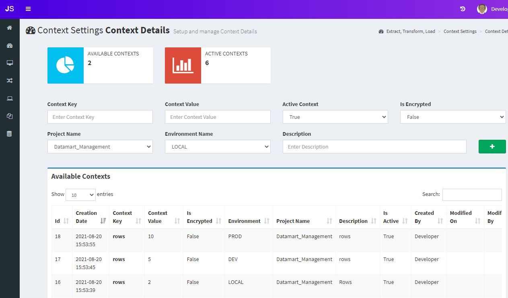

Once you have add those 3 contexts, that's all we need for this use case.


## Explaining jobseeker python functions
Open up the file [pyjob.py](code/pyjob.py) and take a look in the jobseeker functions being called.
```
# This function starts jobseeker passing the environment and jobname as arguments
js = jobSeeker(environment,jobName)

# This function queries from jobseeker context database the context key "rows" we just added and store its value.
rows = int(js.getContext("rows"))

# This function starts the transaction in the TMF framework in jobseeker, passing the event_text and dimension as arguments.
js.begin("Sample Python Job","DW_Master")

# This function finishes the transaction in TMF framework in jobseeker, displaying the ready status, passing the processed rows(rows read and rows processed) + a message field for logging porpuse.
js.end(rows,rows,msg)

# This function updates the transaction in TMF framework in case any error and stores the exception error message.
js.error(str(e))
```

This simple [pyjob.py](code/pyjob.py) python script, basically query context from jobseeker database, starts a jobseeker transaction, process a simple pandas dataframe, convert it into html, ends the jobseeker transaction and outputs the pandas dataframe to the console.

## Deploying python job

Note that you can run this python script in your local machine in case you have python installed, otherwise you can deploy to jobseeker server.

After editing the db connection params as mentioned, go to the [code](code) folder you have downloaded, select both [pyjob.py](code/pyjob.py) and [code/script](code/script)  folder , right mouse button click, go to send to and zipped folder and rename it to pyjob.zip

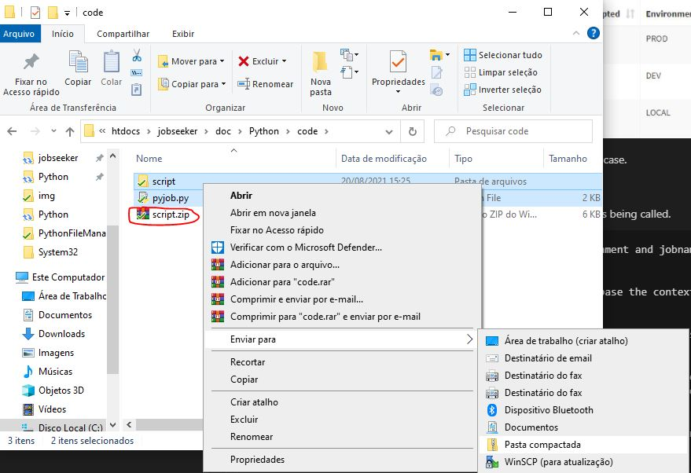

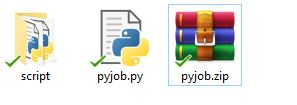

You'll find a pyjob.zip file, save this, we will input into jobseeker this file.

## Creating a jobseeker job

Go to the jobseeker home page, navigate under job management, and click on Job Creation. <br>
Type in Job Name field "pyjob" <br>
Description you can type anthing which describes your job,<br>
Check the box "Execute a windows local command or script"<br>
Click on the checkbox "I confirm this job is my responsaibility and has my confidence."
Below at execute a windows command, for Execution strategy, select "Script execution" and for Script Type select "python Script".<br>
A dropzone box will appear, drag the zip file we just created (pyjob.zip) or click into the dropzone area and upload the file.<br>

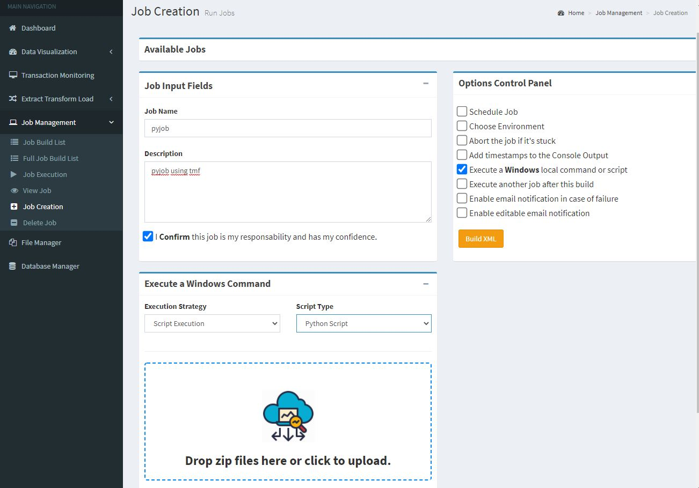

And we have the file uploaded to the jobseeker server as following:

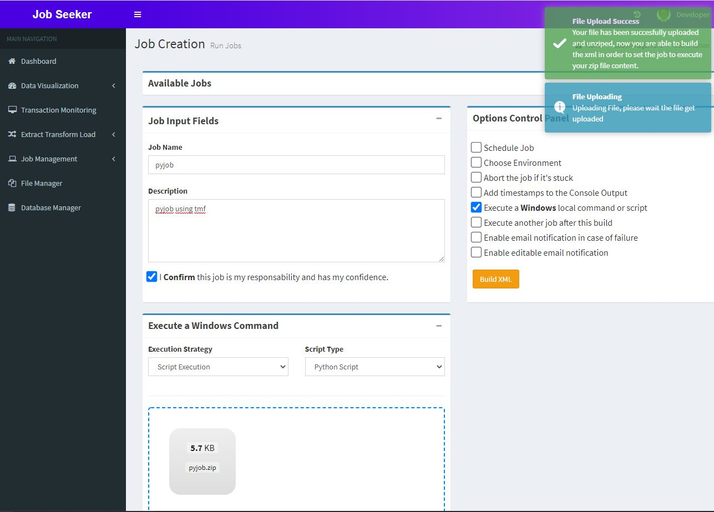

### Choosing an Environment
Check the box "Choose Environment" <br>
Below in the "Select an Environment" box, select "PROD".

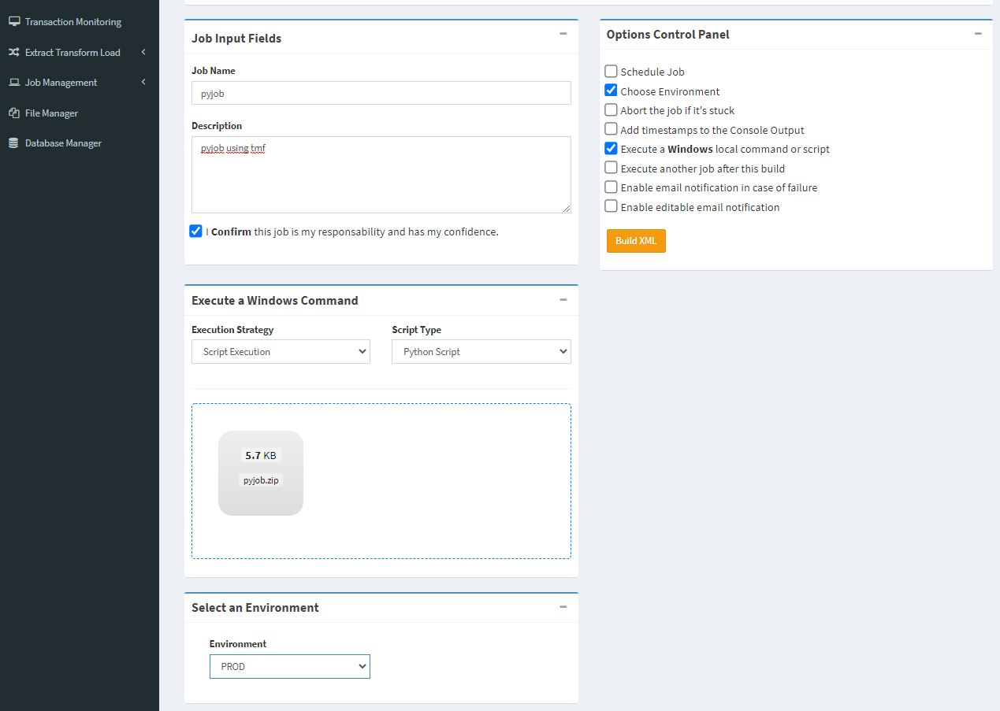

### Publishing Job

Click on button "Build XML" <br>
Click on the checkbox "I confirm this job is my responsaibility and has my confidence." <br>
Click on the button "Send Job".


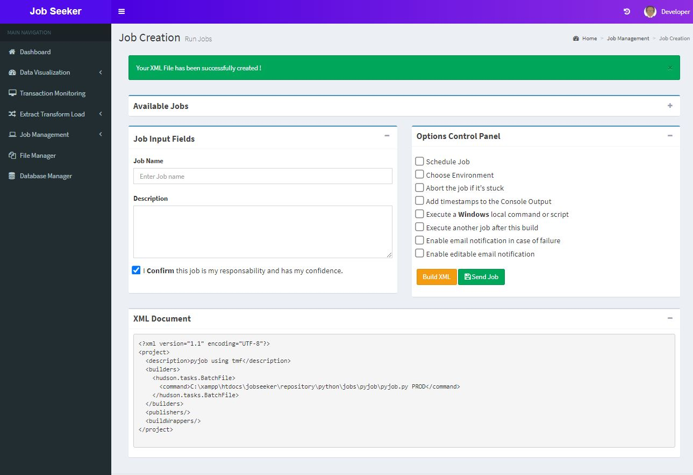

Your job has been successfully published.

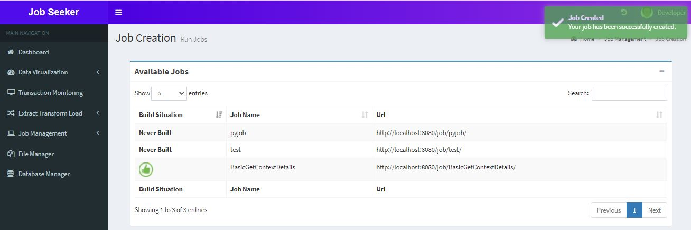


## Running job
Go to Jobseeker home page, navigate over Job Management, click on "Job Execution"<br>
Select the job we just created in the Job Selector, "pyjob"<br>
Click on the button "Play".

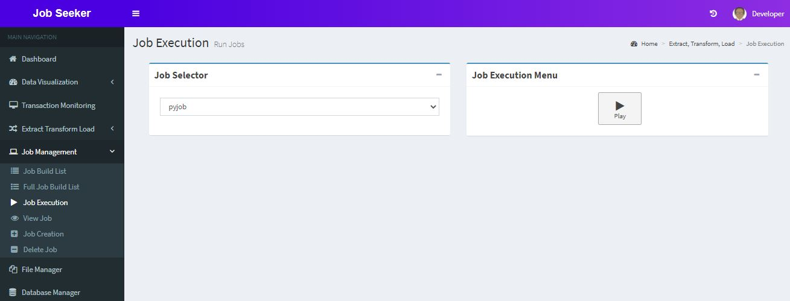

Your job is running as requested.

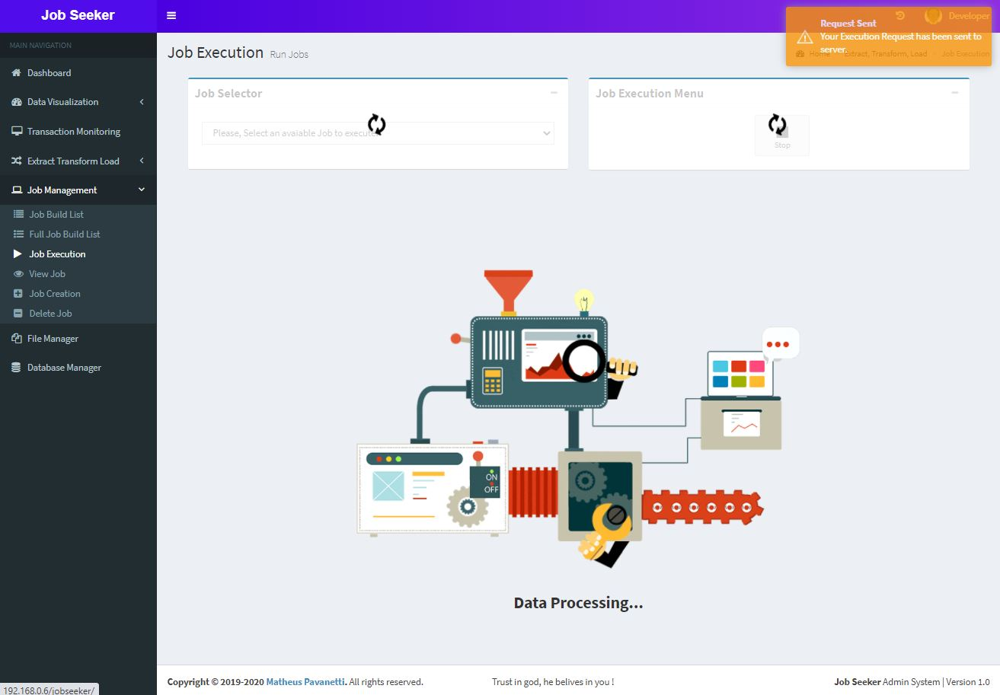


 Your job has been successfully executed, and you can check the results in the Console Log Output view

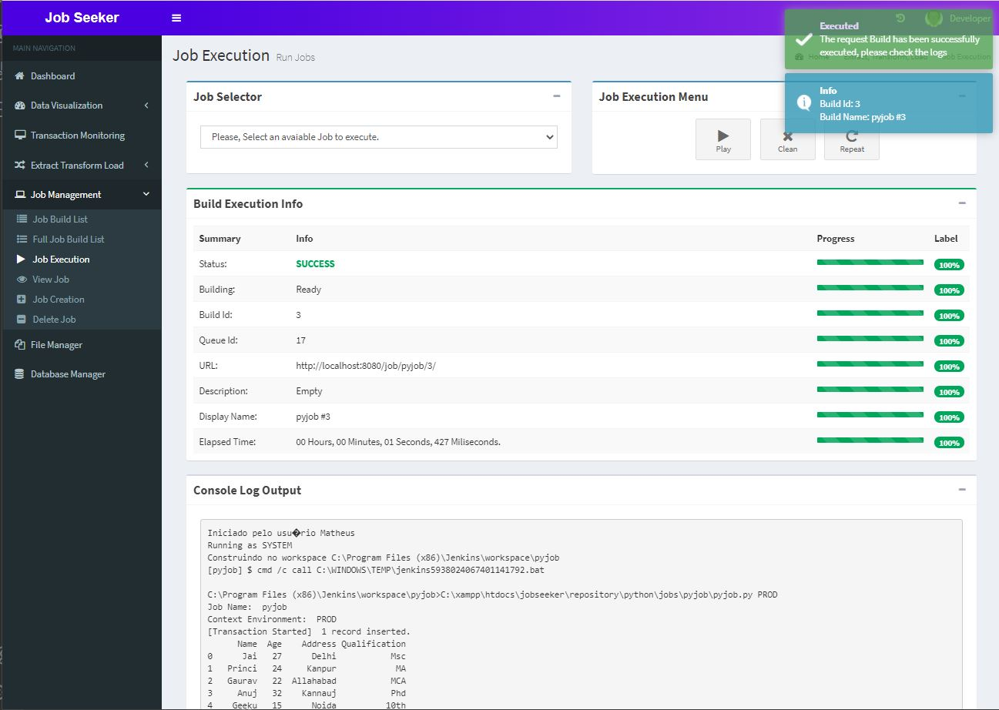


## Checking job server logs

You can either check the server job log frmo the Job Management, Job Build List or Full Job Build List which is a more complete job log history and contains all the executions.<br>
You can click in the build numbers to check the latest logs.

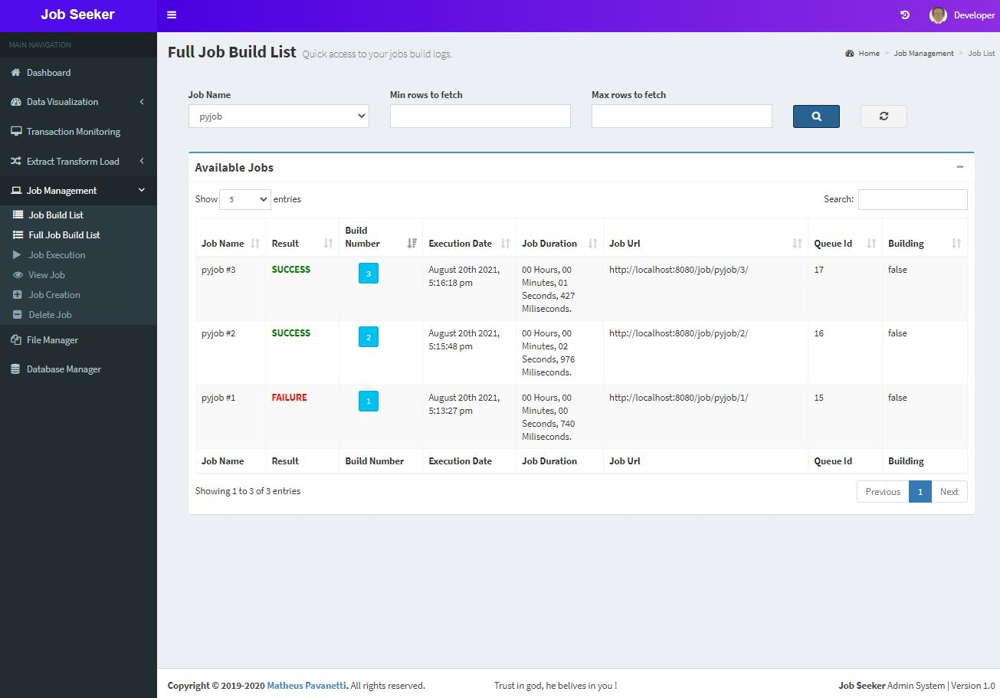

Click on the last build number, check the server logs, note that 10 rows has been retrived, that's why we selected the PROD environment which specifies 10 rows must be retrieved.

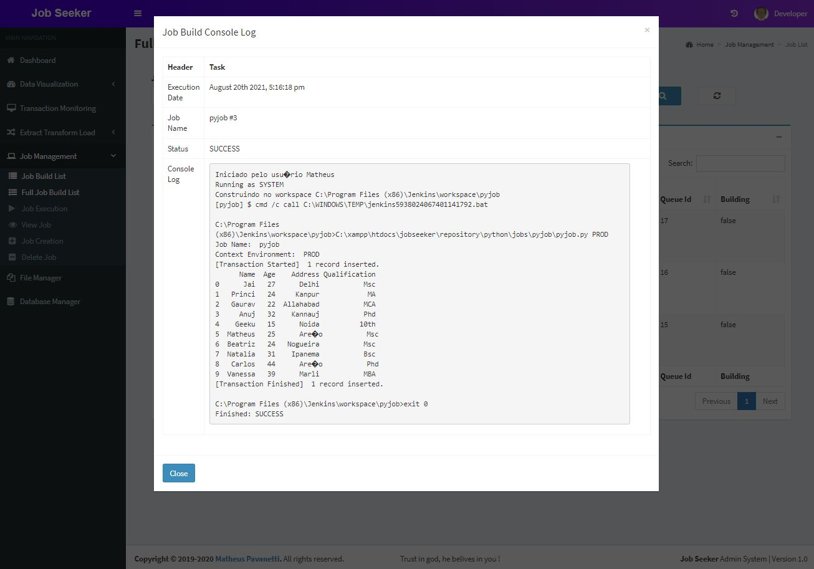

Check the Job Build List option under Job Management also, click on button Load Data<br>
In this area you can trigger multiple jobs and check their results in real time. also check the latest success and failure job build.

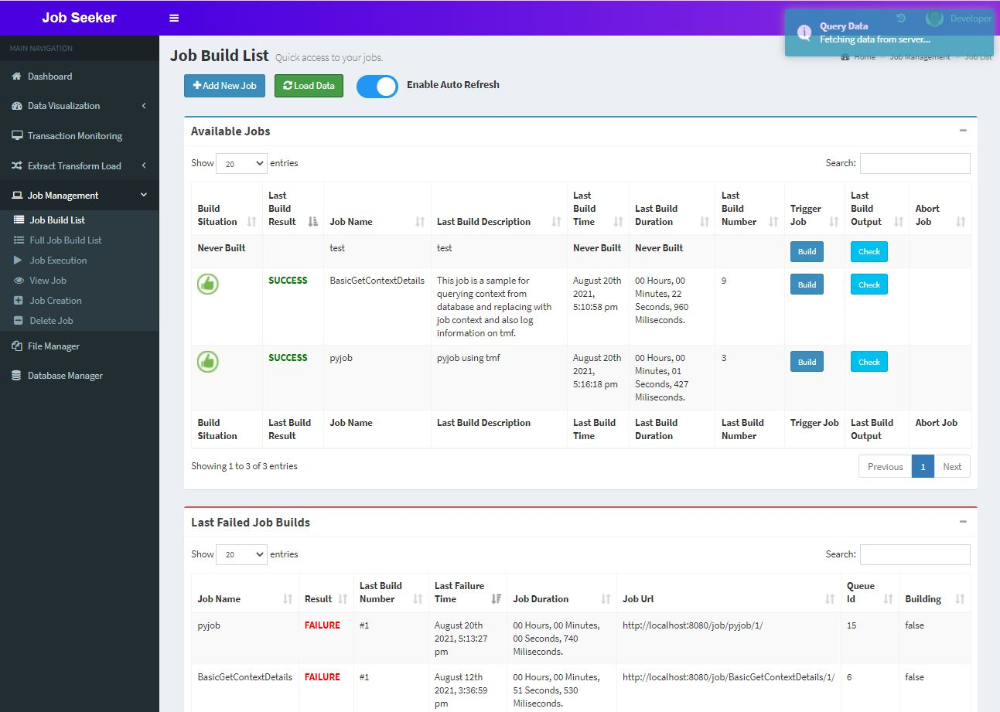

### Checking Transaction Monitoring

Go to the jobseeker left side navigation bar, select Transaction Monitoring Framework.<br>
On Query Builder, select the "PROD" environment at Available Environments dropdown and select today's date at "From Date" field.<br>
Select pyjob in the avialable job name dropdown<br>
Click on search button (blue button)

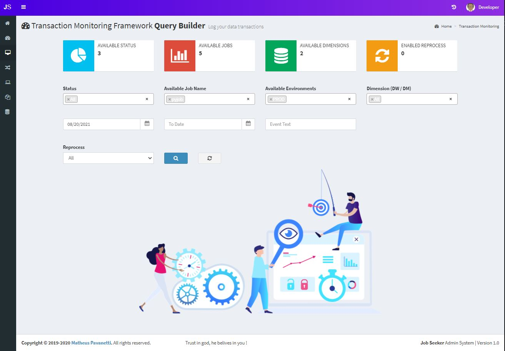

Here we have the result of our job executions and total of processed records.<br>
Click on Check Message button.

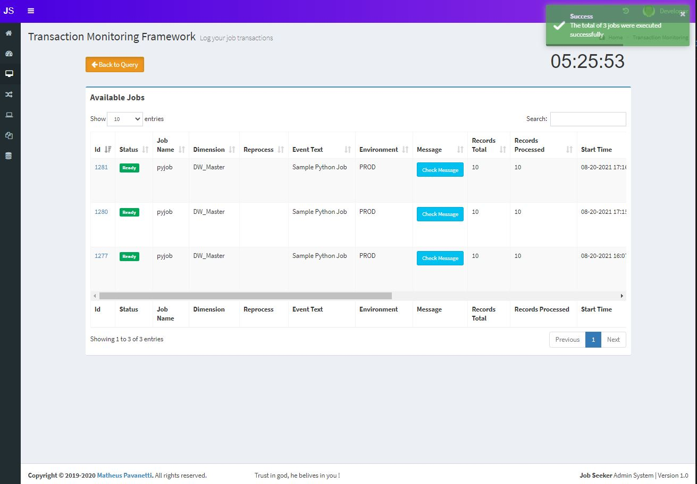

This is the pandas html table output we did in the pyjob job.

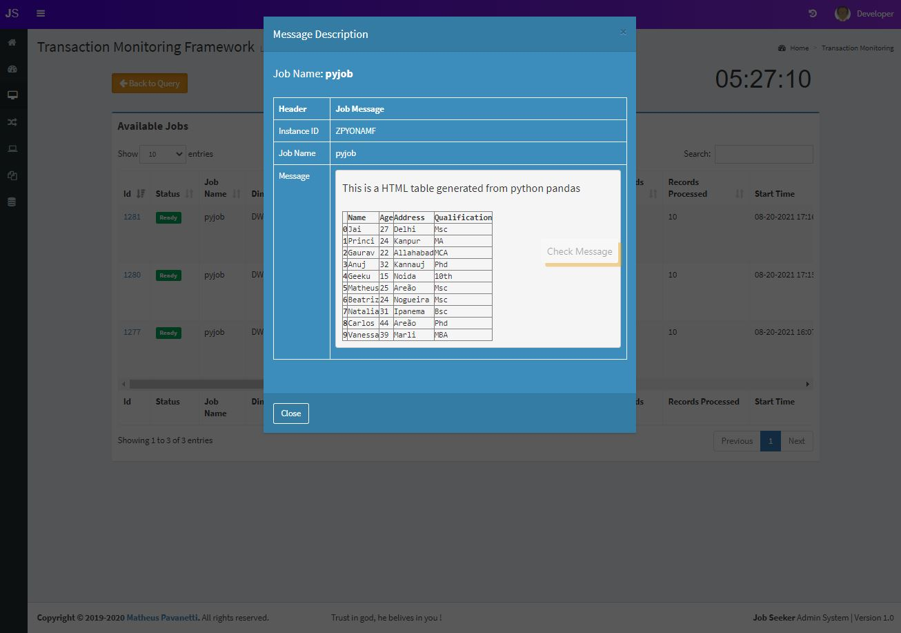


## Test it 

Feel free to test using other python scripts, more contexts, and implement your ideas ! contexts replacement per environment are very useful when you have connections, credentials, variables that needs to has a different value per environment.

Thanks.