# JobSeeker Python SDK

JobSeeker ships a small Python SDK that lets Python jobs write to the Transaction Monitoring Framework (TMF), read context values, resolve Data Assets, update progress, and report failures with very little boilerplate.

Jobs created from the Job Creation screen receive the SDK as a preinstalled runtime package, so new jobs can import it directly:

```python
from jobseeker import JobSeeker
```

The downloadable sample now only needs [code/pyjob.py](code/pyjob.py) and [code/requirements.txt](code/requirements.txt). The `jobseeker` package is provided by the JobSeeker runtime for uploaded files, inline scripts, repository paths, Git sources, Jenkins-agent execution, and Docker execution.

## Runtime Requirements

The current SDK runtime writes TMF records through MariaDB and declares `mysql-connector-python` as its own package dependency. Python jobs do not need to include that dependency in their `requirements.txt` just to use `jobseeker`.

The sample uses pandas, so its [code/requirements.txt](code/requirements.txt) contains:

```text
pandas
```

JobSeeker resolves database settings from environment variables first, then uses the defaults from the local Docker stack:

| Variable | Default |
| --- | --- |
| `JOBSEEKER_DB_HOST` or `MYSQL_HOST` | `mariadb` |
| `JOBSEEKER_DB_PORT` or `MYSQL_PORT` | `3306` |
| `JOBSEEKER_DB_USER` or `MYSQL_USER` | `mysql` |
| `JOBSEEKER_DB_PASSWORD` or `MYSQL_PASSWORD` | `mysql` |
| `JOBSEEKER_DB_NAME` or `MYSQL_DATABASE` | `jobseeker` |

The SDK also contains an HTTP transport boundary for a future JobSeeker API. When matching backend endpoints are available, jobs can switch transports with `JOBSEEKER_TRANSPORT=api`, `JOBSEEKER_API_URL`, and `JOBSEEKER_API_TOKEN` without changing task code.

## Reading and writing Data Assets

Data Assets are environment-aware file contracts managed under **Extract Transform Load → Data Assets**. They replace the separate File Upload, Input Components, and Output Components workflows.

Register an Input asset with key `customer-reference`, select CSV, and upload [code/customer_reference.csv](code/customer_reference.csv). A Python job can then read both the file and its catalog metadata without a hardcoded path:

```python
with JobSeeker(environment="PROD", job="load-customers") as js:
    source = js.asset("customer-reference")
    rows = source.read()
    print(source.uri, source.version, source.checksum)
```

Register `customer-summary` as an Output CSV to create a stable write destination:

```python
target = js.asset("customer-summary", mode="output")
target.write([{"country": "US", "active_customers": 2}])
```

Use `read_dataframe()` and `write_dataframe()` for pandas, Excel, or Parquet workloads. The catalog supplies CSV delimiter/header/encoding and Excel sheet metadata automatically. `dataset()` is an alias for `asset()` when dataset terminology reads more naturally.

See the complete [code/data_asset_job.py](code/data_asset_job.py) example and the [Data Assets guide](../jobseeker/ETL/data-assets/README.md).

The example transforms the bundled four-row CSV into a `customer-summary` output containing active-customer counts for the UK and US. Opening Data Assets after the run discovers the generated file and publishes its size, SHA-256 checksum, and next revision automatically.

## Success Email Metrics

Success email templates can show ETL row counts and duration. Publish those values near the end of a successful job:

```python
js.email_metrics(
    dataset="customers_daily",
    rows_read=12500,
    rows_written=12492,
    rows_rejected=8,
    duration="2m 14s",
)
```

The SDK writes stable `JOBSEEKER_EMAIL_*` markers to the Jenkins console and a `jobseeker-email-metrics.properties` file for the Success template. JobSeeker transports that file from both local and Docker Python runtimes. Jobs that do not publish metrics show `Not reported` in those cells.

## Context Manager Style

Use one `JobSeeker` client for the job, then create one TMF task per tracked unit of work. Each task writes its own TMF row and has its own `instance_id`.

```python
from jobseeker import JobSeeker


with JobSeeker(environment="PROD", job="load_customers") as js:
    with js.task("Load customers", "DW_Master") as tmf:
        limit = tmf.context("rows", cast=int, default=100)

        processed = load_customers(limit)

        tmf.progress(processed=processed, total=limit, msg="Loaded customer batch")
        tmf.finish(total=limit, processed=processed, msg="Customer load complete")
```

If code inside the `with js.task(...)` block raises an exception, the SDK records a TMF error and re-raises the exception so Jenkins still marks the build as failed.

## Decorator Style

For compact scripts, decorate the operation function. If the function accepts a `tmf` keyword argument, the SDK injects the active task object.

```python
from jobseeker import JobSeeker


js = JobSeeker(environment="PROD", job="load_orders")


@js.track("Load orders", "DW_Master")
def run(tmf):
    limit = tmf.context("rows", cast=int, default=100)
    processed = load_orders(limit)
    tmf.finish(total=limit, processed=processed, msg="Orders loaded")


if __name__ == "__main__":
    run()
```

The module-level decorator works the same way when you do not need to keep a client object:

```python
from jobseeker import task


@task("Load invoices", "DW_Master", job="load_invoices", environment="PROD")
def run(tmf):
    batch_size = tmf.context("rows", cast=int, default=100)
    processed = load_invoices(batch_size)
    tmf.finish(total=batch_size, processed=processed)
```

## Reading Context Values

Context values are read from `vw_contextdetails` using parameterized queries. The modern API can cast, default, or require values:

```python
rows = tmf.context("rows", cast=int, default=10)
endpoint = tmf.context("api_url", required=True, project="Default")
```

Use `project` when the same context key exists in multiple projects.

## Progress And Failure Logging

Use `progress` for heartbeats and partial counters during long jobs:

```python
for index, row in enumerate(rows, start=1):
    process(row)
    if index % 500 == 0:
        tmf.progress(processed=index, total=len(rows), msg="Processed {} rows".format(index))
```

Use `finish` when the task completes. Let exceptions bubble out of the task block; the SDK records them in `tmf_error` automatically.

```python
with js.task("Build report", "DW_Master") as tmf:
    report = build_report()
    tmf.finish(total=1, processed=1, msg=report.html)
```

## Creating Contexts

Go to JobSeeker home page, navigate to Extract, Transform Load -> Context Settings -> Context Details, and add context key values for each environment.

For this sample, add a `rows` context:

| Environment | Context Key | Context Value |
| --- | --- | --- |
| `LOCAL` | `rows` | `2` |
| `DEV` | `rows` | `5` |
| `PROD` | `rows` | `10` |

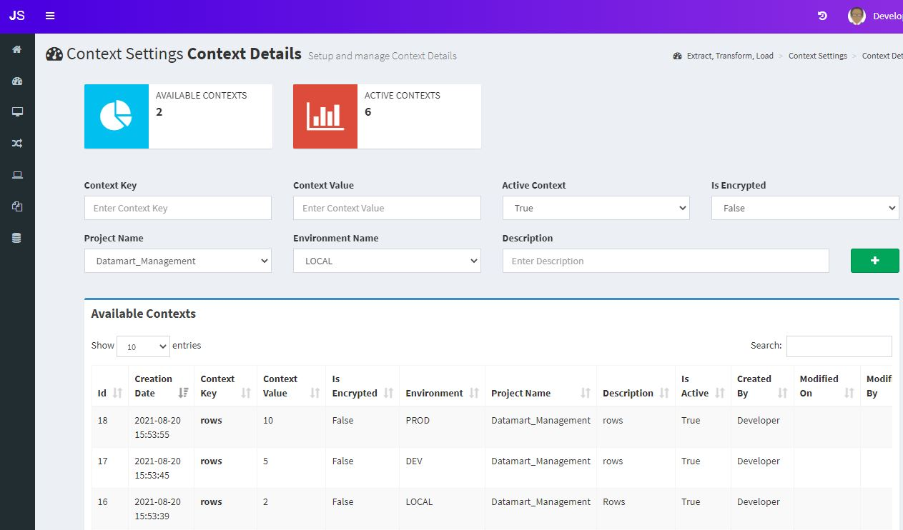

## Deploying Python Jobs

JobSeeker supports Python jobs from a single uploaded `.py` file, a ZIP, an existing repository path, a Git repository, or the inline Python editor. In every mode, the runtime installs the bundled SDK first, so scripts can use `from jobseeker import JobSeeker` without bundling helper code or adding `mysql-connector-python` to job requirements.

Inline Python opens a small workspace with the entry script, optional `requirements.txt`, extra `.py` files, and a Dockerfile tab when Docker runtime is selected. Empty inline jobs start from a JobSeeker template that reads the `rows` context value, writes progress, and finishes a TMF row. The magic-wand button restores that starter template.

Python jobs can run on Jenkins agent `python3` or inside a Docker image such as `python:3.12-slim`. Use Docker when a job needs a specific Python version or system packages. For ZIP/path/Git sources, put `requirements.txt` and optional `Dockerfile` at the source root or beside the entry script.

## Demo Seed Jobs

The root [seed_demo_data.sh](../../seed_demo_data.sh) script stages the bundled SDK package into `repository/python/lib/jobseeker-sdk` and creates two runnable Python SDK demo jobs:

- `demo-python-sdk-agent` runs on the Jenkins agent, imports `JobSeeker`, writes progress, and finishes a TMF row.
- `demo-python-sdk-docker` runs inside `python:3.12-slim`, installs the same SDK package inside the container, and writes a TMF row through the Docker runtime.

Use `DEMO_PREFIX=showcase ./seed_demo_data.sh` to create the same jobs with a different prefix, and `./seed_demo_data.sh --cleanup` to remove both the Jenkins jobs and their TMF rows.

## Running The Sample

To run the downloadable sample as a ZIP, select [code/pyjob.py](code/pyjob.py) and [code/requirements.txt](code/requirements.txt), then zip them as `pyjob.zip`.

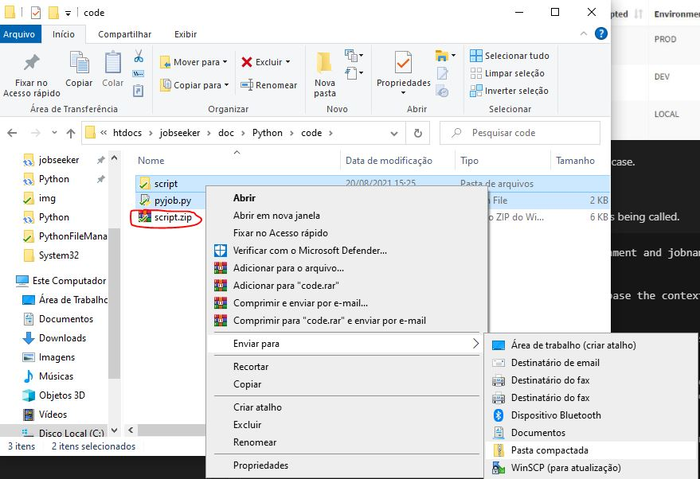

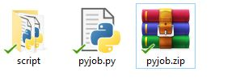

Create a Python job named `pyjob`, select Python source upload, upload `pyjob.zip`, set the entry file to `pyjob.py`, and choose an environment such as `PROD`.

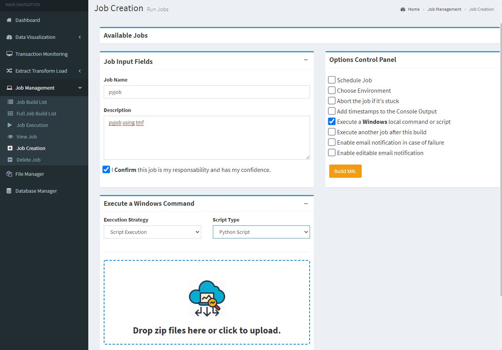

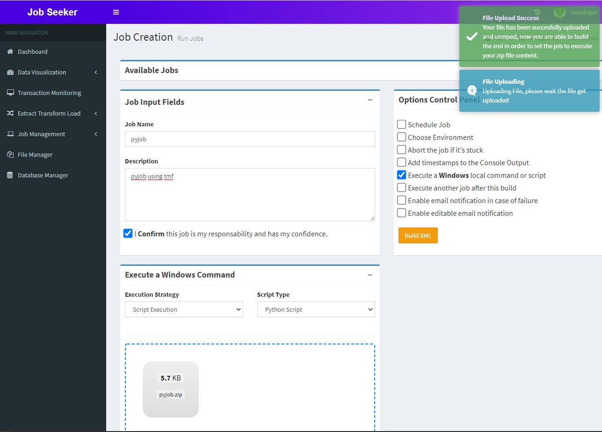

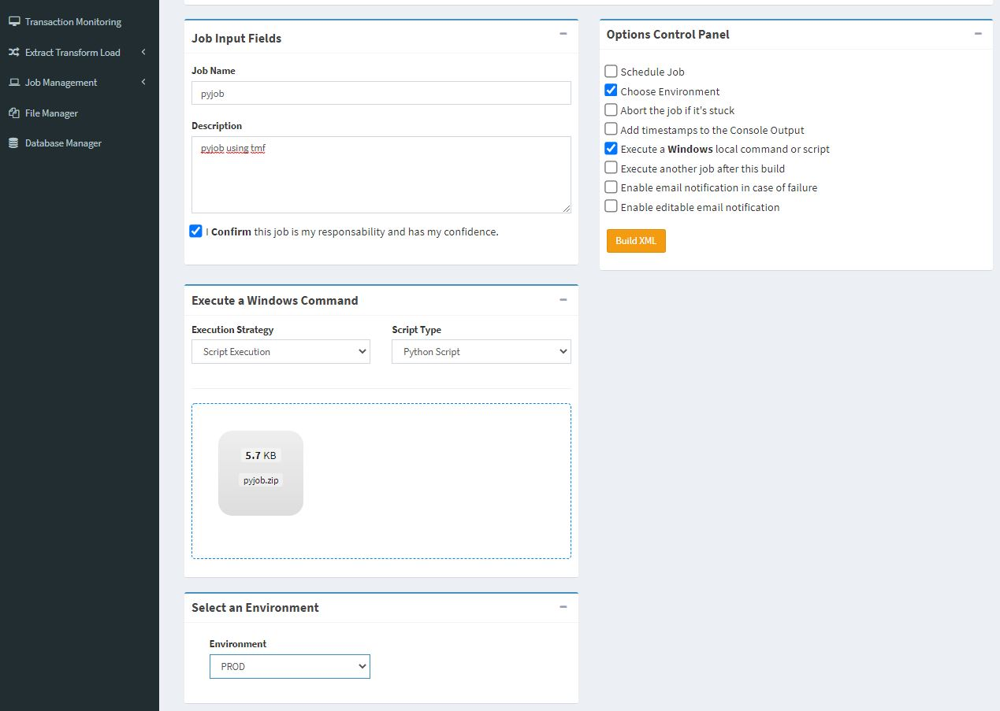

Publish the job, then run it from Job Execution.

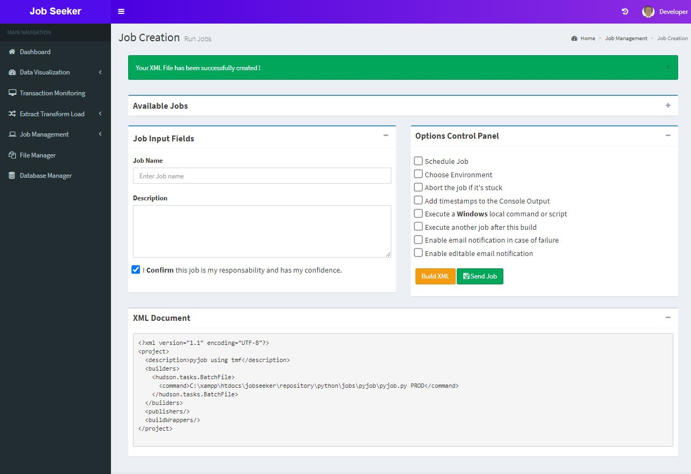

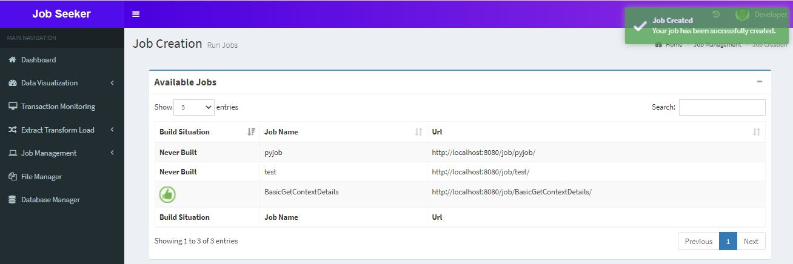

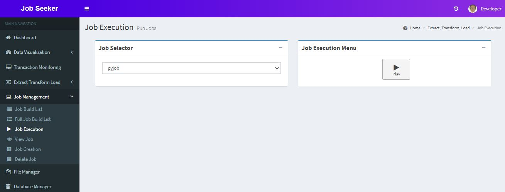

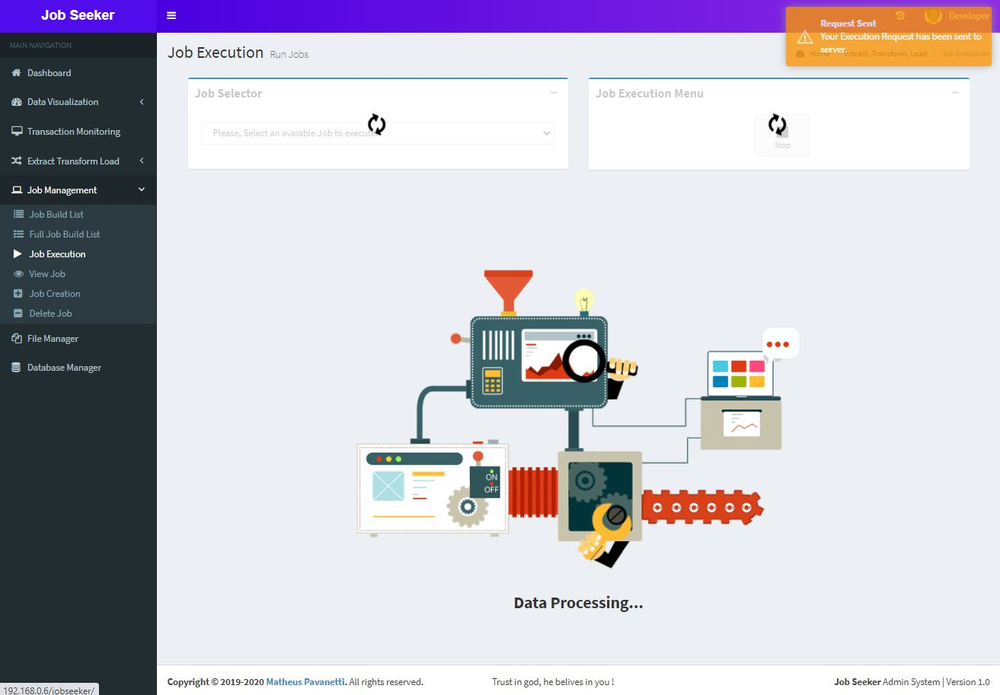

The Jenkins console shows the Python output and email metrics, while the Transaction Monitoring Framework shows the TMF row and HTML message produced by `tmf.finish(...)`.

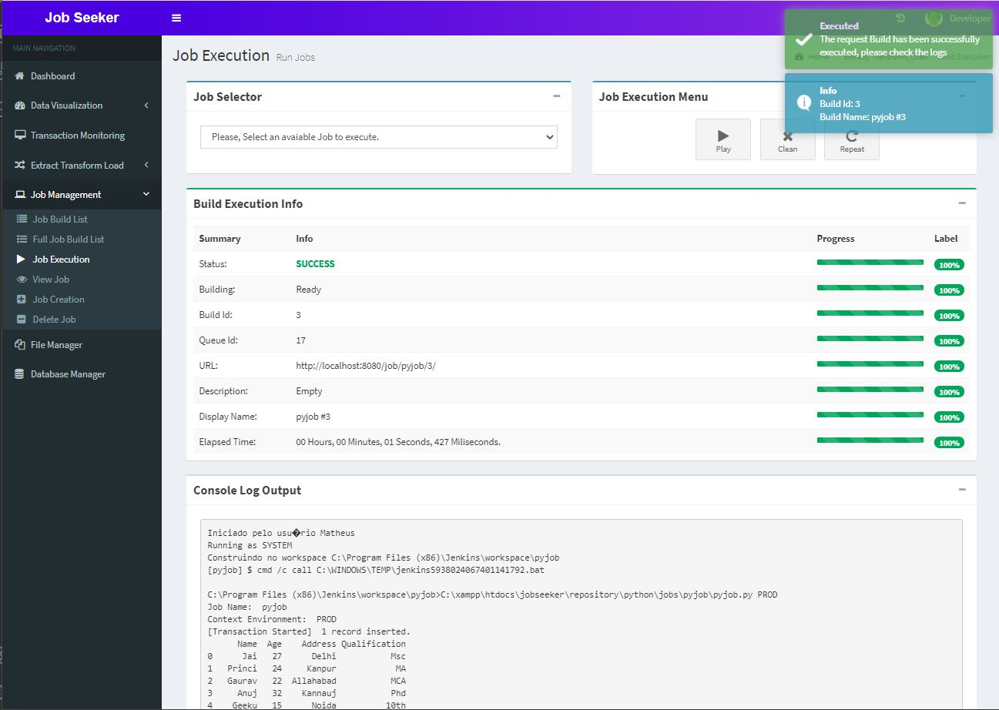

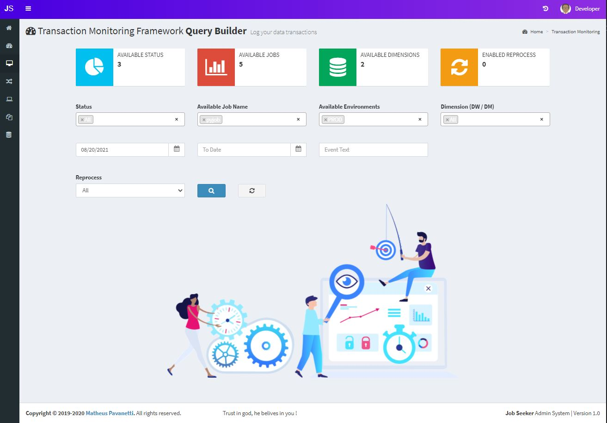

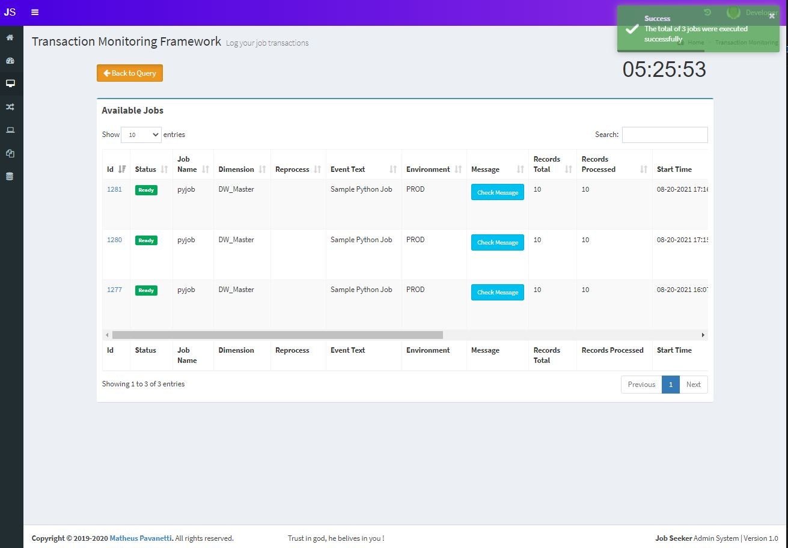

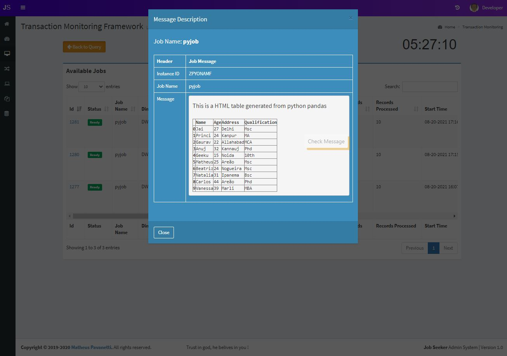
