# JobSeeker Python SDK

JobSeeker ships a small Python SDK that lets Python jobs write to the Transaction Monitoring Framework (TMF), read context values, resolve Data Assets and connectors, update progress, and report failures with very little boilerplate.

Jobs created from the Job Creation screen receive the SDK as a preinstalled runtime package, so new jobs can import it directly:

```python
from jobseeker import JobSeeker
```

The downloadable sample now only needs [code/pyjob.py](code/pyjob.py) and [code/requirements.txt](code/requirements.txt). The `jobseeker` package is provided by the JobSeeker runtime for uploaded files, inline scripts, repository paths, Git sources, Jenkins-agent execution, and Docker execution.

## Runtime Requirements

The current SDK runtime writes TMF records through MariaDB and declares `mysql-connector-python` as its own package dependency. Python jobs do not need to include that dependency in their `requirements.txt` just to use `jobseeker`.

The sample uses pandas, so its [code/requirements.txt](code/requirements.txt) contains:

```text
pandas
```

JobSeeker resolves database settings from environment variables first, then uses the defaults from the local Docker stack:

| Variable | Default |
| --- | --- |
| `JOBSEEKER_DB_HOST` or `MYSQL_HOST` | `mariadb` |
| `JOBSEEKER_DB_PORT` or `MYSQL_PORT` | `3306` |
| `JOBSEEKER_DB_USER` or `MYSQL_USER` | `mysql` |
| `JOBSEEKER_DB_PASSWORD` or `MYSQL_PASSWORD` | `mysql` |
| `JOBSEEKER_DB_NAME` or `MYSQL_DATABASE` | `jobseeker` |

The SDK also contains an HTTP transport boundary for a future JobSeeker API. When matching backend endpoints are available, jobs can switch transports with `JOBSEEKER_TRANSPORT=api`, `JOBSEEKER_API_URL`, and `JOBSEEKER_API_TOKEN` without changing task code.

## Reading and writing Data Assets

Data Assets are environment-aware file contracts managed under **Extract Transform Load → Data Assets**. They replace the separate File Upload, Input Components, and Output Components workflows.

Register an Input asset with key `customer-reference`, select CSV, and upload [code/customer_reference.csv](code/customer_reference.csv). A Python job can then read both the file and its catalog metadata without a hardcoded path:

```python
with JobSeeker(environment="PROD", job="load-customers") as js:
    source = js.asset("customer-reference")
    rows = source.read()
    print(source.uri, source.version, source.checksum)
```

Register `customer-summary` as an Output CSV to create a stable write destination:

```python
target = js.asset("customer-summary", mode="output")
target.write([{"country": "US", "active_customers": 2}])
```

Use `read_dataframe()` and `write_dataframe()` for pandas, Excel, or Parquet workloads. The catalog supplies CSV delimiter/header/encoding and Excel sheet metadata automatically. `dataset()` is an alias for `asset()` when dataset terminology reads more naturally.

For optional starter data, let the job continue when no matching contract exists:

```python
source = js.asset("customer-reference", required=False)
if source is not None:
    print(source.read())
```

`DataAsset` also implements Python's path protocol, so current path-aware libraries accept it directly—`pandas.read_csv(source)` works. Prefer `source.read_dataframe()` when you want the catalog's delimiter, encoding, header, or sheet metadata applied automatically. Do not pass `source.relative_path` to file libraries; it is catalog metadata relative to the repository, while `source.path` is the absolute runtime path.

See the complete [code/data_asset_job.py](code/data_asset_job.py) example and the [Data Assets guide](../jobseeker/ETL/data-assets/README.md).

The example transforms the bundled four-row CSV into a `customer-summary` output containing active-customer counts for the UK and US. Opening Data Assets after the run discovers the generated file and publishes its size, SHA-256 checksum, and next revision automatically.

## Resolving ETL connectors

Connectors are named connection contracts scoped by environment and job. Configure a `warehouse` key in **Extract Transform Load > Connectors**, then resolve it without hardcoding endpoint or credential values:

```python
import psycopg

with JobSeeker(environment="PROD", job="load-orders") as js:
    warehouse = js.connector("warehouse")
    connection = psycopg.connect(
        host=warehouse.host,
        port=warehouse.port,
        dbname=warehouse.database,
        user=warehouse.username,
        password=warehouse.password,
    )
```

Use `get_connector("warehouse")` for code that does not need a `JobSeeker` client. Arbitrary authentication fields are available through `connector.value("api_key", required=True)`, `connector.value("sas_token", required=True)`, or their configured names. Runtime jobs receive only connectors matching their global environment/job scope. Encrypted local values and secrets retrieved from Azure Key Vault, AWS Secrets Manager, or worker environment mappings are materialized immediately before execution and deleted during cleanup. The ETL job remains responsible for creating and configuring its database driver or service client.

See the [ETL Connectors guide](../jobseeker/ETL/connectors/README.md) for shell/Talend usage and deployment authentication.

## Success Email Metrics

Success email templates can show ETL row counts and duration. Publish those values near the end of a successful job:

```python
js.email_metrics(
    dataset="customers_daily",
    rows_read=12500,
    rows_written=12492,
    rows_rejected=8,
    duration="2m 14s",
)
```

The SDK writes stable `JOBSEEKER_EMAIL_*` markers to the Jenkins console and a `jobseeker-email-metrics.properties` file for the Success template. JobSeeker transports that file from both local and Docker Python runtimes. Jobs that do not publish metrics show `Not reported` in those cells.

## Context Manager Style

Use one `JobSeeker` client for the job, then create one TMF task per tracked unit of work. Each task writes its own TMF row and has its own `instance_id`.

```python
from jobseeker import JobSeeker


with JobSeeker(environment="PROD", job="load_customers") as js:
    with js.task("Load customers", "DW_Master") as tmf:
        limit = tmf.context("rows", cast=int, default=100)

        processed = load_customers(limit)

        tmf.progress(processed=processed, total=limit, msg="Loaded customer batch")
        tmf.finish(total=limit, processed=processed, msg="Customer load complete")
```

If code inside the `with js.task(...)` block raises an exception, the SDK records a TMF error and re-raises the exception so Jenkins still marks the build as failed.

## Decorator Style

For compact scripts, decorate the operation function. If the function accepts a `tmf` keyword argument, the SDK injects the active task object.

```python
from jobseeker import JobSeeker


js = JobSeeker(environment="PROD", job="load_orders")


@js.track("Load orders", "DW_Master")
def run(tmf):
    limit = tmf.context("rows", cast=int, default=100)
    processed = load_orders(limit)
    tmf.finish(total=limit, processed=processed, msg="Orders loaded")


if __name__ == "__main__":
    run()
```

The module-level decorator works the same way when you do not need to keep a client object:

```python
from jobseeker import task


@task("Load invoices", "DW_Master", job="load_invoices", environment="PROD")
def run(tmf):
    batch_size = tmf.context("rows", cast=int, default=100)
    processed = load_invoices(batch_size)
    tmf.finish(total=batch_size, processed=processed)
```

## Reading Context Values

Context values are read from `vw_contextdetails` using parameterized queries. The modern API can cast, default, or require values:

```python
rows = tmf.context("rows", cast=int, default=10)
endpoint = tmf.context("api_url", required=True, project="Default")
```

A job of a project (a project job folder, or a Git job bound to a project) and code running in that project's VS Code editor read the project's own value first, then any project's, so two projects can both define `rows`. Pass `project` to read another project's value. In an editor JobSeeker opened, the environment is the one the workspace was opened for (the top bar), as it is for connectors.

## Progress And Failure Logging

Use `progress` for heartbeats and partial counters during long jobs:

```python
for index, row in enumerate(rows, start=1):
    process(row)
    if index % 500 == 0:
        tmf.progress(processed=index, total=len(rows), msg="Processed {} rows".format(index))
```

Use `finish` when the task completes. Let exceptions bubble out of the task block; the SDK records them in `tmf_error` automatically.

```python
with js.task("Build report", "DW_Master") as tmf:
    report = build_report()
    tmf.finish(total=1, processed=1, msg=report.html)
```

## Creating Contexts

Go to JobSeeker home page, navigate to Extract, Transform Load -> Context Settings -> Context Details, and add context key values for each environment.

For this sample, add a `rows` context:

| Environment | Context Key | Context Value |
| --- | --- | --- |
| `LOCAL` | `rows` | `2` |
| `DEV` | `rows` | `5` |
| `PROD` | `rows` | `10` |

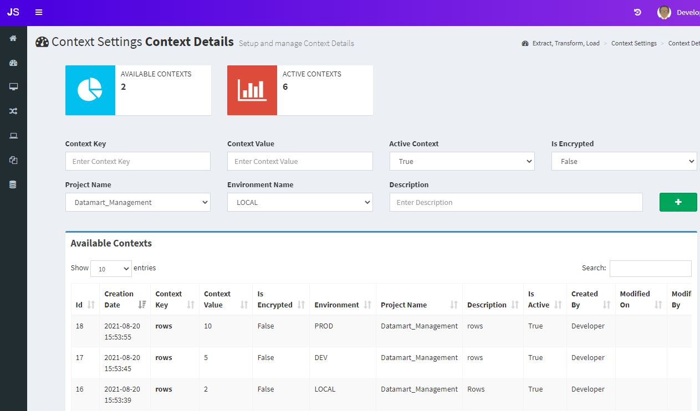

## Deploying Python Jobs

JobSeeker supports Python jobs from a single uploaded `.py` file, a ZIP, an existing repository path, a Git repository, or the inline Python editor. In every mode, the runtime installs the bundled SDK first, so scripts can use `from jobseeker import JobSeeker` without bundling helper code or adding `mysql-connector-python` to job requirements.

Inline Python opens a small workspace with the entry script, optional `requirements.txt`, extra `.py` files, and a Dockerfile tab when Docker runtime is selected. Empty inline jobs start from a JobSeeker template that reads the `rows` context value, writes progress, and finishes a TMF row. The magic-wand button restores that starter template.

Python jobs can run on Jenkins agent `python3` or inside a Docker image such as `python:3.12-slim`. Use Docker when a job needs a specific Python version or system packages. For ZIP/path/Git sources, put `requirements.txt` and optional `Dockerfile` at the source root or beside the entry script.

### Private Git repositories

Create a **Git repository** connector under **Connectors**, give it the provider hostname (for example `github.com`), and choose token, username/password, or SSH-key authentication. SSH connectors also require a pinned `known_hosts` entry. Scope the connector to the environments and job names that may use it. Put a representative private repository URL in **Test repository URL** if the connector's **Test** action should verify authentication with `git ls-remote` rather than only validate its configuration.

In Job Creation, choose **Git Repository URL** and select the connector in **Git Credential**. JobSeeker resolves the credential only when the build starts. HTTPS secrets are passed through an ephemeral `GIT_ASKPASS` file and SSH keys through an ephemeral strict-host-key-checking directory; neither is inserted into the repository URL, command arguments, or generated Jenkins configuration. The helper also refuses to use a connector against a hostname other than the connector's declared provider.

Public Git repositories remain credential-free. Existing jobs that use public `git clone` commands continue to load in the editor.

For interactive development, add personal credentials under **Profile > Git Accounts**. GitHub, GitLab, Bitbucket, Azure DevOps, and self-hosted providers are supported with repository-scoped access tokens, username/app passwords, or SSH keys with pinned `known_hosts` entries. For SSH, JobSeeker can create the key pair for you (**New SSH key**): the private key stays encrypted on the server and the account shows the public key to add to your provider. **Fetch from host** reads the provider's current host keys and shows their fingerprints; compare them with the ones your provider publishes before saving. A host-wide account can coexist with more specific owner/repository accounts; the longest matching scope wins. When the deployment configures a GitHub OAuth client, **Continue with GitHub** authorizes private repository access in the browser; otherwise, use a personal access token. Prefer a fine-grained token limited to the required repositories and grant Contents write permission only when the workspace must push. Use **Test** on an account with an actual private repository URL to verify both its scope and authentication. These personal accounts are separate from job connectors: builds use the selected project/job connector, while OpenVSCode pulls and pushes as the user who opened the workspace.

### Git projects: one repository, a branch per environment

A project in **Context Settings > Project Details** is a scope for context variables and the place its jobs are developed. It has a **type** (Python, Shell or Apache Hop), and Git is optional. Turn on **Source code in Git** to give the project one repository:

- **Repository URL**, HTTPS or SSH, without credentials in it.
- **Build access**: how builds clone it, the same in every environment. Leave it public, pick a shared Git connector, or create one on the spot: **New access token** (paste a read-only token) or **New deploy key** (JobSeeker generates the key pair, keeps the private key encrypted, and shows the public key to add as a read-only deploy key; a deploy key works with an HTTPS URL too). Either is saved as an ordinary Git connector for all environments and jobs, so **Connectors** can rotate or remove it later. To use a different secret in one environment, add a connector with the same key scoped to that environment.
- **Branches**: a branch per environment (for example `develop` in DEV, `main` elsewhere), or **one branch everywhere** for trunk-based work. Empty fields inherit from **Other environments**, then from the deployment-wide policy (`JOBSEEKER_GIT_ENVIRONMENT_BRANCHES`, by default `develop` in DEV and `main` elsewhere).
- **Check access** lists the repository's branches once, as a build would (on a Jenkins worker when a credential is used), and marks every environment's branch that does not exist.

One repository holds every job of the project, one folder each:

```
jobs/
  load-orders/     main.py, pyproject.toml, tests/, optional Dockerfile
  daily-report/
shared/            code every job can import: from shared.greeting import hello
```

A job's **Job folder** (`jobs/<job>` by default for a project job; empty means the repository root, for a repository that holds a single job) is where its build runs: dependencies, the Dockerfile and pytest are taken from that folder, so jobs never pick up each other's dependencies or tests, and the entry file is a path inside it. Builds clone only the job's folder and `shared/` (a sparse clone without the contents of other folders), so a large repository does not slow every job down; a worker whose `jobseeker-git` predates sparse clones clones the whole branch instead, and says so in the console. `shared/` is on `PYTHONPATH` on the Jenkins agent, in Docker containers and in VS Code, for Git projects and for jobs that run a project's shared folder in place.

A Git job bound to the project stores only the project, its job folder, its entry file and, optionally, a pinned branch or tag. It does not copy the repository, branch or credential: when a build starts, it asks JobSeeker which repository, branch and credential the project uses in the build's environment. Changing the QA branch in the project therefore reaches every QA job on its next build, and promotion has nothing Git-related to rewrite; the promotion screen only offers to pin a branch or tag for that deployment. Job Creation lists only projects with Git, and shows a bound job's repository and credential read-only.

### Developing a project in OpenVSCode

**VS Code** in the sidebar opens a project without creating a job first. Pick a project, or create one there (name, type and, recommended, a Git repository URL), and choose what to work on:

- **The team branch**: the project's branch for the selected environment (for example `develop` in DEV), which that environment's jobs run. Everyone's work meets here; pull before you push.
- **My own branch** (`work/<you>`): forked from the team branch. Nobody else pushes to it; the first push publishes it, and you merge it into the team branch when it is ready.
- **Another branch**, such as a feature branch.

Every person gets a working copy of their own, `repository/workspaces/u<user>/<project>-<id>`, cloned once with their personal Git account, so nobody edits the files someone else is editing; their work meets only through Git. A project without Git is a single folder everyone shares (`repository/workspaces/shared/<project>-<id>`) that jobs run in place; link a repository for personal copies and branches. An empty repository starts with the layout above (`README.md`, `jobs/`, `shared/`); an existing repository is never changed by opening it.

In the editor, run the task **JobSeeker: new job** to add `jobs/<name>/` with a runnable starter (entry file, `pyproject.toml`, a test); it prints the Job Creation link for that folder. **JobSeeker: run current job file** and **JobSeeker: test current job** run from the folder of the current file with `shared/` importable, as a build does. One `.venv` at the project root has the SDK and every job's dependencies: a job with a `poetry.lock` installs exactly what it locks, one without is installed straight from its `pyproject.toml`, so opening a project never writes lock files into anyone's job folders. Each `jobs/<job>` folder gets a connector session for the job of that name, and the project root one for connectors shared by all jobs.

**Job Creation** turns a folder into a job: under Python, **From a project workspace** lists the job folders in your workspace of a project, with whether builds can see them yet (*not committed*, *uncommitted changes*, *not pushed*, *pushed*). Choosing one fills in the project, job folder, entry file, runtime (Docker when the folder has a Dockerfile), tests and, if it was not typed, the job name.

### Project runtimes: Python versions, Conda and dev containers

Projects need different environments, so each one chooses where it opens under **Runtime** in the VS Code launcher:

- **Default editor**: the shared OpenVSCode service with Python, uv and Poetry. Every project starts here, and small projects never need more.
- **A runtime from the catalog**, managed under **Runtimes** in the sidebar: a Python version with system and Python packages, a Conda `environment.yml` (created as the `jobseeker` environment on Miniforge), or any glibc-based Dockerfile, each with the VS Code extensions, dev container features, ports and post-create command it needs.
- **A template**: the Runtimes page's gallery has ready-made runtimes for data engineering, dbt, data quality, streaming, dashboards, notebooks, R, FastAPI, full stack, machine learning, PyTorch, LLM apps, Spark, geospatial and cloud work; choosing one in the launcher adds it to the catalog. Any runtime or template also downloads as a `.devcontainer` for VS Code on your machine or Codespaces, with the JobSeeker SDK inside so `import jobseeker` works there too.
- **Dev container**: the project's own `.devcontainer/devcontainer.json`, read from your workspace. JobSeeker builds its `image` or `build.dockerfile` (with `context`, `args` and `target`), installs its `features` from their registry (such as `ghcr.io/devcontainers/features/node:1`), and applies `containerEnv`, `remoteEnv`, `customizations.vscode.extensions`, `customizations.vscode.settings`, `postCreateCommand` and `postStartCommand`. Local features, extra mounts, `runArgs` and Compose-based definitions are reported and ignored. Only the files the Dockerfile copies are part of the build, so editing code never rebuilds the image. A project without one can get a starter from the launcher (**Add a starter**): the Python starter (a slim Python image, `.devcontainer/requirements.txt` for packages every job shares, room for extensions) or any template or catalog runtime as the project's own; commit it so the team gets the same environment.

A project on a runtime opens in an editor of its own, built from that image with the VS Code server added on top. **Just me** gives everyone a container of their own; **Shared** runs one container the team opens together. Either way the editor mounts only this project (your working copy, or everyone's for Shared), the SDK read-only and Data Assets, and the launcher sets its CPUs and memory. The first open of a runtime builds it, which takes a few minutes, and the tab that opens shows the build log. Later opens start in seconds. **Rebuild** in the launcher builds it again for newer base images and packages; the editor keeps working meanwhile and moves to the new image at its next open. Editors stop after the OpenVSCode idle timeout and start again on the next open. The **Runtimes** page lists every deployment, with its output, **Stop** and **Remove**, and administrators can **Reclaim images** nothing uses any more. In a Shared editor of a Git project every person still works in their own working copy, and commits and pushes as themselves.

Inside a runtime the project works as it does in the Default editor: **JobSeeker: setup Python environment** builds `.venv` from the runtime's own Python, with `--system-site-packages`, so what the image preinstalled (Conda's GDAL, a CUDA PyTorch) is importable while each job keeps its own dependencies. A job folder with a `uv.lock` installs its locked versions. Switching runtime recreates `.venv`.

Docker jobs can run the same image: choosing a job folder of a project on a runtime (**From a project workspace**) sets the job to Docker with the runtime's image, built runtimes appear in the Docker image suggestions of any Python job as `jobseeker-runtime/<runtime>:<hash>`, and a job's own Dockerfile can start `FROM` one (such builds skip `--pull`, since runtime images exist only in the job runtime). Runtime images are tagged by a hash of their recipe, so editing a runtime builds a new image and never changes one a saved job uses. A new job folder's `pyproject.toml` asks for the runtime's Python (`requires-python = ">=3.12"` on a Python 3.12 runtime; `>=3.10` when the version cannot be read from the image). If a job's `requires-python` leaves out the image's Python anyway, the Docker build warns and installs the listed dependencies with pip instead of failing in Poetry; widen `requires-python` to get the Poetry install back. See [Workspace runtimes](../jobseeker/Architecture/workspace-runtimes.md) for the design, security model and settings.

### Notebooks as jobs

A Python job's entry file can be a Jupyter notebook (`.ipynb`). The job runs it top to bottom in a Jupyter kernel, like **Run All** in VS Code, and the first cell that raises fails the build; later cells are skipped. In Job Creation, **From a project workspace** offers every script and notebook of a job folder, and the **Notebook run** panel appears for a notebook:

- **Parameters**, as papermill does: the cell tagged `parameters` holds the notebook's defaults (in VS Code: the cell's **...** menu > **Add Cell Tag**), and the job's values go into a new cell tagged `injected-parameters` right after it. **From the notebook** lists that cell's variables, reading a Context value of the same name when the project has one. Each value is a literal (numbers, `true`/`false`, lists and quoted strings are typed as JSON), a **Context** key resolved for the job's environment and project when the build starts, or an **Environment** variable of the build. A missing Context value fails the run rather than running on a different input.
- **Run with parameters** on View Job runs it once with other values; they travel as the build parameter `JOBSEEKER_NOTEBOOK_PARAMETERS` (a JSON object such as `{"rows": 10}`), so a Jenkins **Build with Parameters** can set them too.
- A **cell timeout**, **keep running after a failing cell** (the build still fails), and **Transaction Monitoring**: on by default, each run is one TMF transaction whose records are the code cells, and a failure carries the failing cell's traceback.

The build log shows the run as the notebook: a timeline of the cells (click one to jump to it), the parameters and where each came from, every cell's highlighted source and output, and the failing cell. The runner saves the executed notebook after every cell under `repository/notebook-runs/<job>/<build>/` (the last 20 builds of each job); the log loads its charts and tables from it and **.ipynb** downloads it. A notebook that runs in a container is published when the build finishes.

A runtime with Jupyter (the **Jupyter notebooks** template) runs notebooks as they are. Elsewhere the build installs `nbclient` and `ipykernel` for the run, or put them in the job's dependencies as the notebook samples do (**Start from a sample** in the VS Code launcher, or **JobSeeker: add sample** in the editor). Without them the runner still runs plain Python cells, skipping IPython magics. The runner is `jobseeker.notebook` in the SDK (`python -m jobseeker.notebook run report.ipynb --parameters '{"rows": 5}'`), so a notebook runs the same way in a terminal.

### Developing a Git job in OpenVSCode

A Git job runs the branch in **Branch or Tag**, cloned fresh for every build, so a merge into that branch reaches the next run without redeploying. **Open in VS Code** beside the Git settings gives you a working copy to develop in:

- A job bound to a project opens your own workspace of that project (above), with the job's folder in it; a new job's folder is created with starter files. A job whose code is already on a branch (a saved job, or one just moved to Git) never gets starter files that would collide with it; pull or merge that branch instead.
- A job without a project gets its own working copy: JobSeeker clones the repository once into `repository/python/git/<job>` and checks out the development branch configured for that environment (DEV defaults to `develop`; unmatched environments default to `main`). If that remote branch does not exist yet, it is created locally from the repository's default branch, and your first push creates it on the remote. Opening the workspace again never re-clones or overwrites your work.
- Commit, pull, and push from the Source Control view or terminal. Commits use the profile identity of the JobSeeker user who most recently opened the workspace. The credential helper requests the matching personal Git account only for each Git operation; it does not save the secret in the repository or Git configuration.
- The job continues to run **Branch or Tag**, independently of the workspace branch. This is typically `develop` in DEV and `main` elsewhere, but both the job form and deployment flow allow an explicit release branch or tag.
- The editor's own files (`.vscode/`, `.venv/`, `.env.jobseeker`, …) are listed in `.git/info/exclude`, so they never appear as changes in your repository.

**Add a sample** (or **Samples** while Git Source is selected) adds a Python sample from the library to the job's folder in the working copy and opens it in VS Code, where you review, commit and push it. Nothing is overwritten: if any sample file already exists in the folder, the whole sample goes into `samples/<sample-id>/` inside it and the job's entry file is pointed there. Starter files nobody has edited yet are replaced by the sample.

The Git panel has two separate checks. **Test my access** (in the VS Code card) checks that your personal account can read the repository. **Test** next to **Build credential** checks what builds will use: a Git connector is tested on a Jenkins worker, materialized exactly as a build materializes it, against the job's repository and branch; a public build is tested without credentials.

Configure branch policy with `JOBSEEKER_GIT_ENVIRONMENT_BRANCHES`, for example `DEV=develop,QA=release/qa,DEFAULT=main`. **Environment Deployment** preselects the target environment's branch, shows it in the deployment preview, and lets the operator override it for that promotion. Git-backed Jenkins commands are rewritten to the selected target branch; non-Git jobs are unchanged. This supports a normal `develop` → `main` flow without preventing release branches or environment-specific policies.

### Moving an inline job to Git

An inline job can become a Git job without copying files by hand: choose **Move to Git…** above the inline workspace, enter the repository URL (create an empty repository first, or use one you can push to), and optionally a project, the job's folder in the repository (`jobs/<job>` for a project) and the branch the job runs (the environment default, for example `develop` in DEV). JobSeeker saves the editor's current files, commits them as you, and pushes them with your personal Git account:

- The code, extra files, `pyproject.toml`, lock files, Dockerfile and tests are committed. Virtual environments, caches, editor settings and the workspace connector session (`.env.jobseeker`) are not.
- An empty repository also gets the default release branch (`main`) from the same commit, so promotions to other environments have a branch to deploy.
- If the repository already has different versions of some files, nothing is pushed until you choose **Replace existing files**; the previous versions stay in Git history.
- The working copy becomes the job's VS Code workspace (for a project job, your workspace of the project; if you already have one, the push is made from a temporary clone so your uncommitted work is untouched, and you pull it there), and the form switches to **Git Source** with the repository, folder and branch filled in. **Save the job** to run it from Git, and choose a build credential if the repository is private.

### Changing dependencies

Add libraries however you prefer: edit `pyproject.toml` in Job Creation, run `poetry add`, or run `uv add pandas` in the OpenVSCode terminal. `uv add` updates `pyproject.toml` and `uv.lock` but not `poetry.lock`, which `poetry install` refuses as out of date. The generated Dockerfile, the image-only Docker runtime and the VS Code setup task therefore run `poetry check --lock` first and, when the lock no longer matches, refresh it with `poetry lock` (keeping already locked versions where they still fit) before installing. The build log says when this happens. Generated Dockerfiles from earlier releases are upgraded the next time the job is saved or opened in VS Code; a Dockerfile you have edited yourself is left alone.

### OpenVSCode, local repositories, and local AI

The bundled OpenVSCode Server can edit JobSeeker inline workspaces and any additional host project mounted into the container. For example, create a local override without changing the tracked Compose file:

```yaml
# compose.projects.yml
services:
  openvscode:
    volumes:
      - /absolute/path/to/projects:/home/workspace/projects
```

Start it with `docker compose -f docker-compose.yml -f compose.projects.yml up -d openvscode`, then use **File > Open Folder** for `/home/workspace/projects/<repo>`. Keep host SSH-agent or credential-helper integration in an untracked local override; JobSeeker does not mount a developer's home directory or private keys by default.

An optional fully local coding assistant uses the open-source Continue extension with Ollama. It is excluded from normal builds and starts no model unless explicitly enabled:

```bash
JOBSEEKER_OPENVSCODE_CONTINUE_ENABLED=true docker compose build openvscode
docker compose --profile local-ai up -d ollama openvscode
docker compose exec ollama ollama pull qwen2.5-coder:7b
docker compose exec ollama ollama pull qwen2.5-coder:1.5b
```

The 7B model handles chat/edit requests and the 1.5B model handles low-latency autocomplete. Inline workspaces receive `.continue/rules/jobseeker.md`, which points the assistant at the current job and bundled JobSeeker SDK and tells it to preserve TMF, context, Data Asset, connector, test, and secret-handling contracts. Local-model quality and speed depend heavily on available RAM, CPU, and GPU; use a compatible larger code model in `docker/openvscode/continue-config.yaml` when the host permits it.

## Demo Seed Jobs

The root [seed_demo_data.sh](../../seed_demo_data.sh) script stages the bundled SDK package into `repository/python/lib/jobseeker-sdk` and creates two runnable Python SDK demo jobs:

- `demo-python-sdk-agent` runs on the Jenkins agent, imports `JobSeeker`, writes progress, and finishes a TMF row.
- `demo-python-sdk-docker` runs inside `python:3.12-slim`, installs the same SDK package inside the container, and writes a TMF row through the Docker runtime.

Use `DEMO_PREFIX=showcase ./seed_demo_data.sh` to create the same jobs with a different prefix, and `./seed_demo_data.sh --cleanup` to remove both the Jenkins jobs and their TMF rows.

## Running The Sample

To run the downloadable sample as a ZIP, select [code/pyjob.py](code/pyjob.py) and [code/requirements.txt](code/requirements.txt), then zip them as `pyjob.zip`.

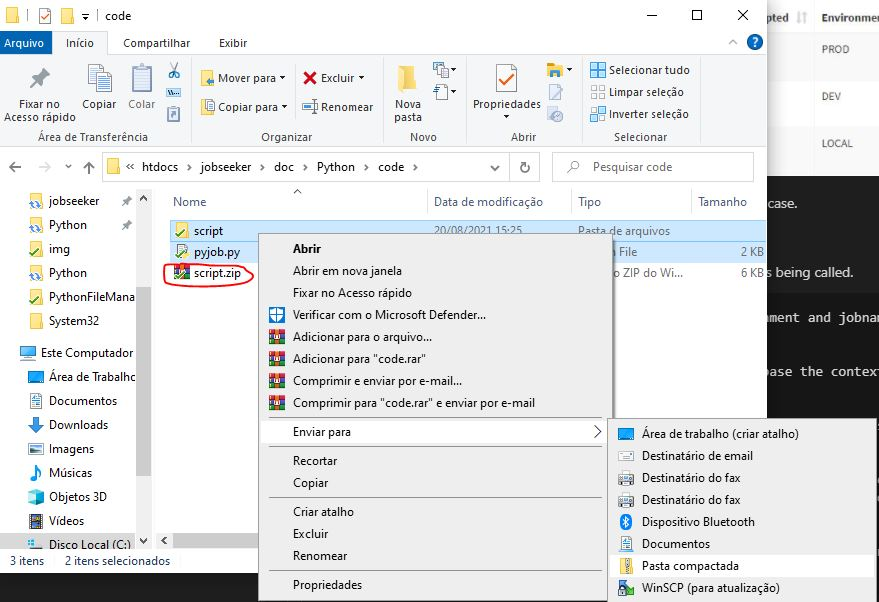

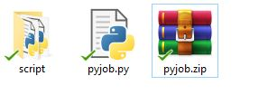

Create a Python job named `pyjob`, select Python source upload, upload `pyjob.zip`, set the entry file to `pyjob.py`, and choose an environment such as `PROD`.

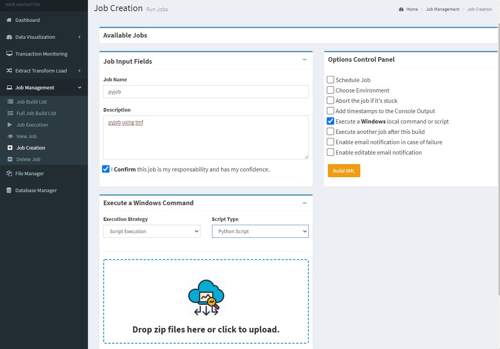

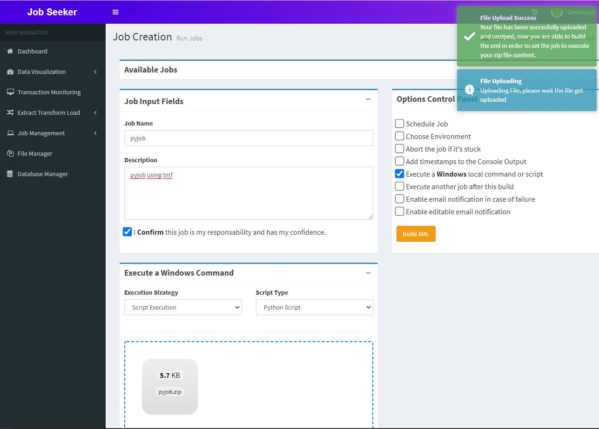

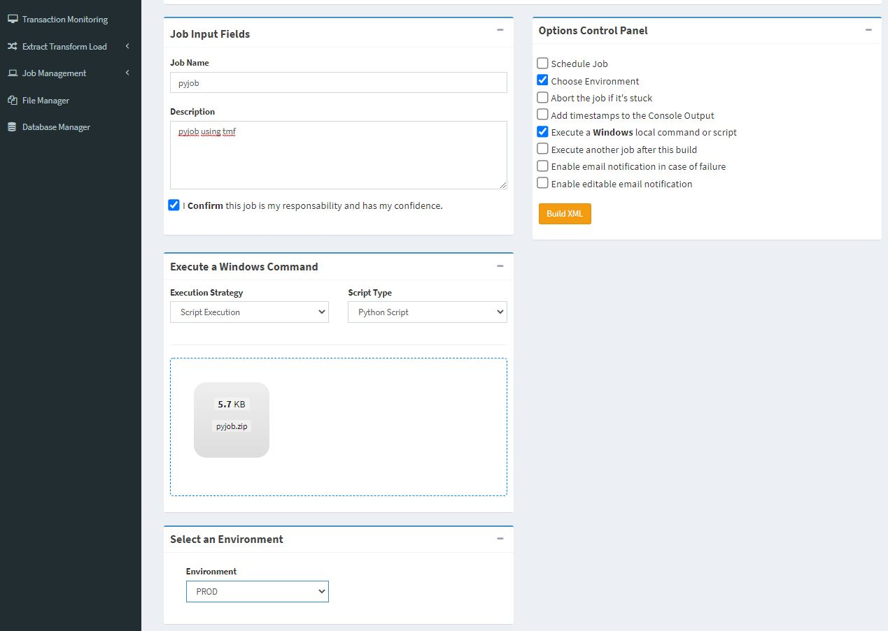

Publish the job, then run it from Job Execution.

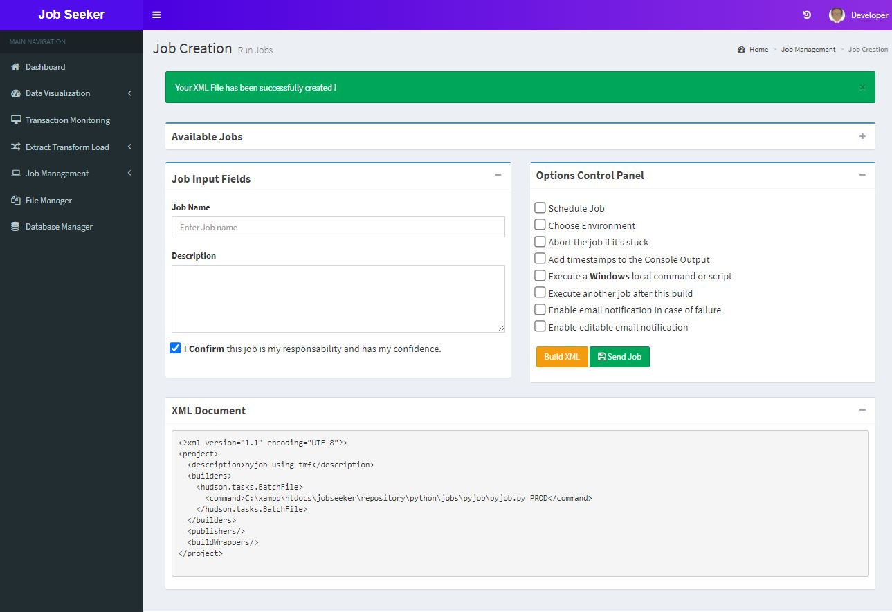

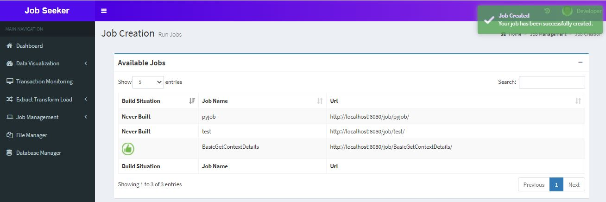

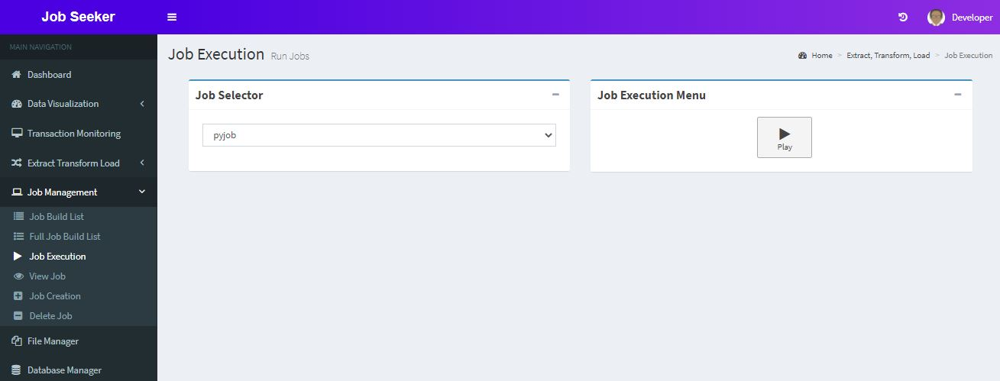

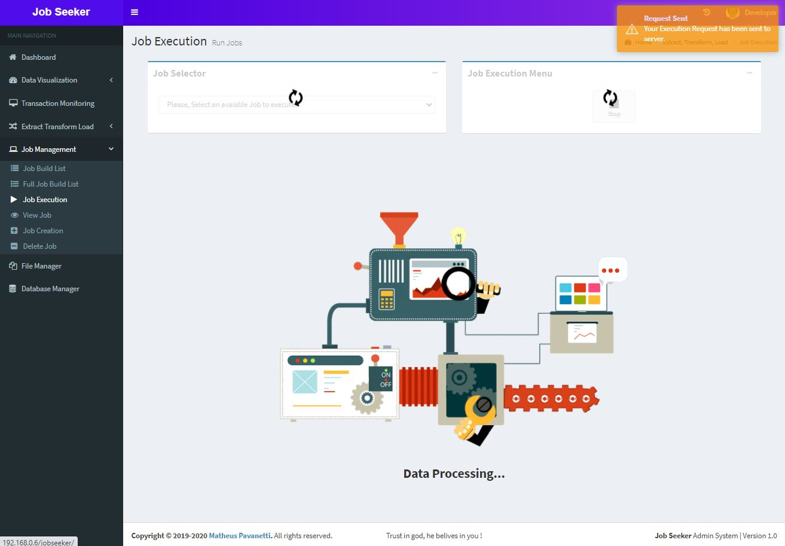

The Jenkins console shows the Python output and email metrics, while the Transaction Monitoring Framework shows the TMF row and HTML message produced by `tmf.finish(...)`.

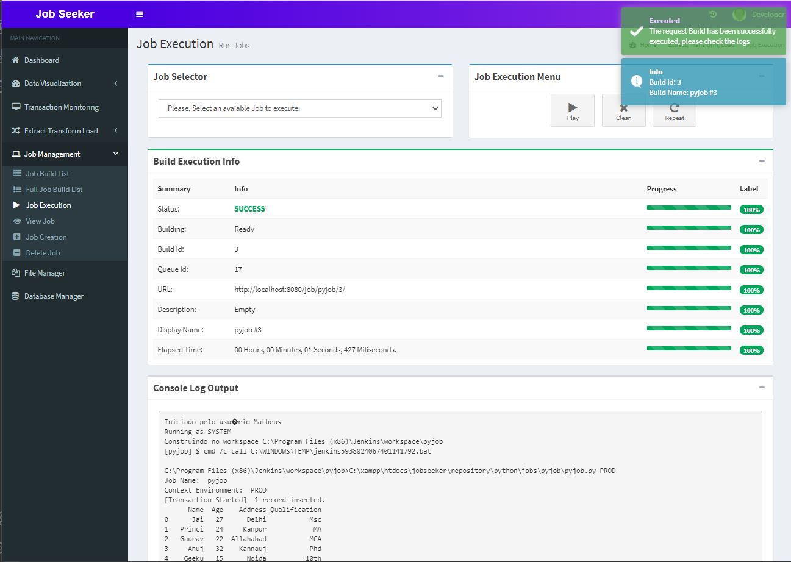

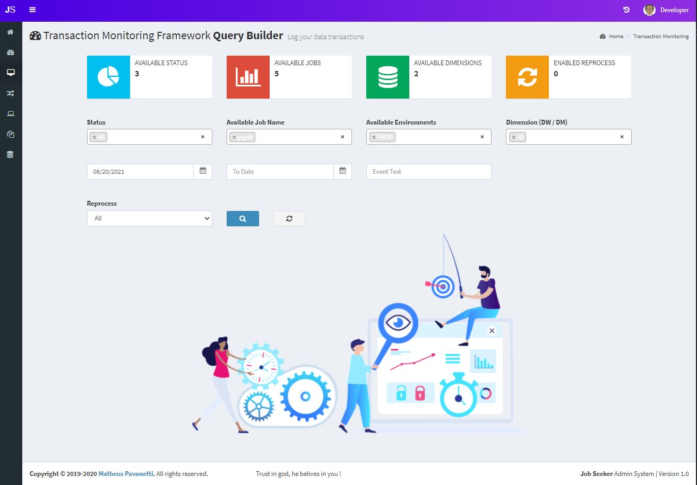

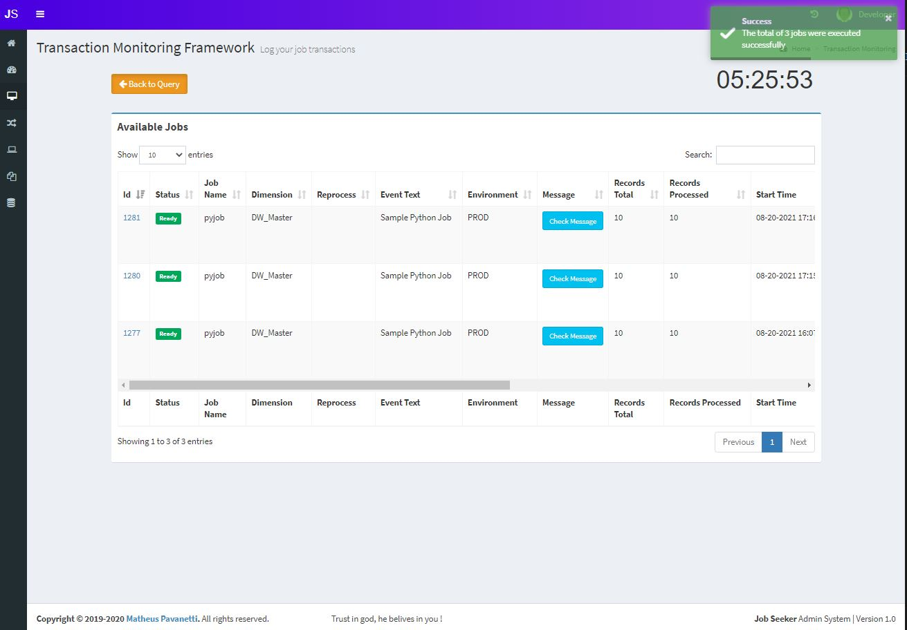

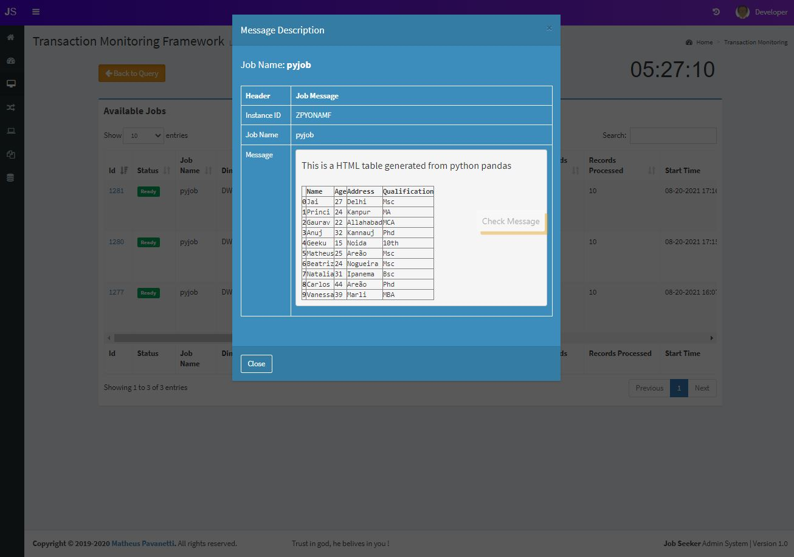
