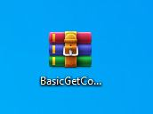

## Talend Open Studio for data Integration use case
This use case demonstrate the functionallity of jobseeker in a real talend ETL job environment, and how jobseeker can be useful.

### Files
- [JobSeekerSampleJobs.zip](JobSeekerSampleJobs.zip) - Download this file to your local machine, import it in Talend Open Studio.
### Importing
Import the downloaded package to into your talend open studio. 
After you import the zip file into your talend open studio, youll see something like this: 

After importing, go to the metadata tab in your repository navegation bar.  
Locate the Db Connections tab, double click on **[Localhost]JobSeeker** metadata, click in **next** and confirm your jobseeker database credentials, click on **Test connection** and then finish.

## Basic TMF Logging

This is a basic implementation of jobseeker logging functionallity in a talend job. 
For that, you need to add the Jobseeker Start, Ready and Error subjobs into your job, in case you have the talend paid version, this could be incorporated into a joblet.
- Start Job (subjob) - this subjob basically generates the starting flag, and insert data into tmf tables.
- Ready Job (subjob) - this subjob basically get the job values, and send the ready flag to tmf tables.
- Error Catcher (subjob) - this catches the errors from the job and loads into tmf tables.

The instructions are also in the job.

Once you have those componentes in your job, you will be able to query your job status and messages in the tmf table, and check messages and errors. 

Message button after a job run.

This job is forcing the result to contain errors and warnings.

Tmf Error message button.

  
 

## Using Contexts replacements in your job.
Here you can implement the context replacement from the context settings databases, in your job, you must have the common context  (ContextEnvironment) with the values well setup. Once you have this template implemented into your job (Get context from database subjob only) and the ContextEnvironment attached into your job, you can create new context direct in the context tab or call from a context group, for example I added the context Custom without any value, and we'll be retrieving its value from the context setting database we setup earlier.

Here we setup 3 different values for the context Custom, each environment has its own context value and the job will query them based on the context key and environment.

Running the job in DEV environment by selecting the DEV context, the value for "Custom" will be retrieved from the context database.

Checking the output value from the tmf message button, you'll see the value of context "custom" has been retrieved from the context database following the DEV environment.

Now let's run the same job switching the context group from DEV to PROD.

now Checking the output value from the tmf message button, you'll see the value of context "custom" has been retrieved from the context database following the PROD environment meaning that you have one job but multiple environments contaning differnt values for your contexts.

## Deploying a talend job

Now that we have a job with the tmf logging table components, also the context replacement components, it's time to compile the job , and deploy it.

Right click on the job **BasicGetContextDetails** from the imported package, click on **Build Job**

 
A Build job window will open. select a path to archive the build, and them finish.
 
 

The Zip file contaning the job binaries has been created on path we provided. keep this file, we'll be uploading this into jobseeker.

Login into jobseeker using a developer account, open the left side bar, go to **Job Management** and click in **Job Creation**. 
This section will provide you the ability of scheduling a job, running a talend job and others, abor the job, send email notifications, and much more.

Now let's fill in the form with our job information. 
**Job Name**: BasicGetContextDetails 
**Description**: This job is a sample for querying context from database and replacing with job context and also log information on tmf.

Lets flag the option **Schedule Job** 
A new window will appear, for trigger action, select Single Execution, then for the Every Minute, remove the option "All" and add "10".

Check the option Choose Environment. 
Select the environment "PROD", the one we created and the one we have contexts.

Check the option Abort the job if it's stuck select "No Activity" and Timeout Seconds 180.

Check the option "Add timestamps to the console output" to timestamp time in your server logs.

  

Flag the option "Execute a Windows local command or script" and flag the option "I confirm this job is my responsability and has my confidence" then a new window will show up. 
For Execution Strategy, select Script Execution and for Type, select "Talend Data Integration Script" 
For the Dropzone,drag and drop the talend build zip file or click to upload the file.
This is what we have so far:

After uploading the talend build job file.

Now let's enable an email notification from jenkins in case of this build fails, flag the option "Enable email notification in case of failure and type the recipients which will receive a failed notification email. remember for that the smtp provider needs to be setup on jenkins. 
we are going to be skipping the "editable email notification" option for now, but keep in mind this is possible, and also the job log can be attached in the email. you can try it by yourself.

Finally, click on "Build XML" to build the xml config for us. 
the xml document will be created and now , click again in the flag "I confirm this job is my responsability and has my confidence" and then in the green button "Send Job" to create a jenkins build.

The recent created job will appear in the available job list. the job has been successfully created.

Let's run the job finally. 
Navigate to Job Management and click on Job Execution, then select the recent created job on Job Selector then click on Play button.

The job is running now, and you can stop when the stop button be avaiable for you if you need to abort a job.

Now check the results and that's it ! your job has been deployed to production, check the tmf results. 
You can also run jobs through "Job Build List" section to run multiple jobs and check the server log results.

