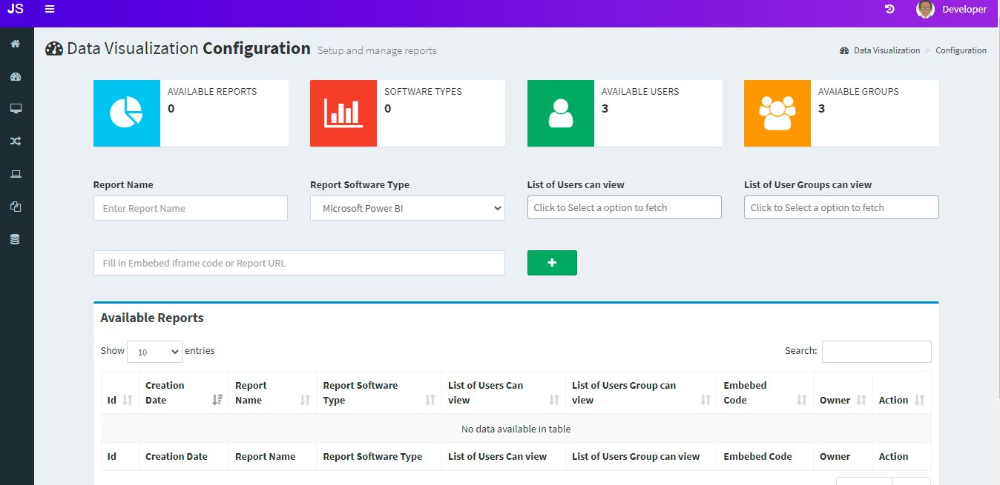
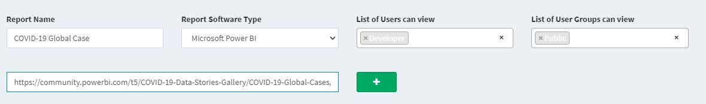
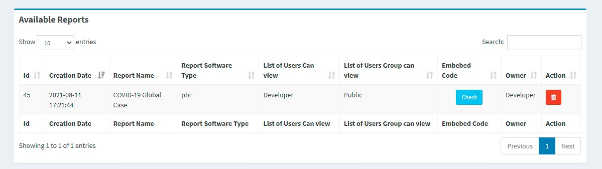
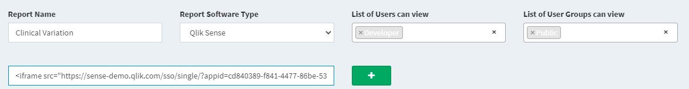
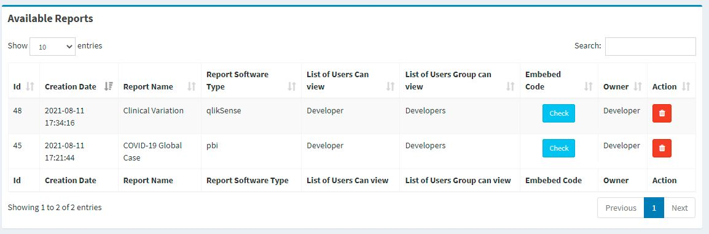
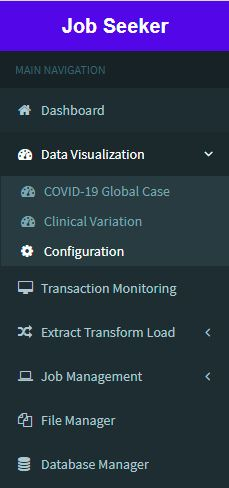
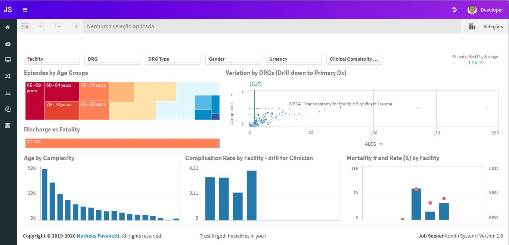

## Data Visualization
With jobseeker tool, you can have your Power Bi, Tableau, Qlik Sense and others dashboards embebed to the tool and restrict the access based on users or user groups quite easy.


  
<br>

## Embebding a dashboard into jobseeker
Log into jobseeker using a developer account, look on the left navigation bar, click data visualization then configuration.<br>
In case there are already dashboards and reports available for you, they will appear under the Data Visualization Menu.<br>

For testing a power bi dashboard, Add the following data to the fields:

**Report Name**: COVID-19 Global Cases<br>
**Report Software Type**: Microsoft Power BI<br>
**List of Users can view**: you can select the user Developer<br>
**List of User groups can view**: you can select Developers<br>
**Url**: https://community.powerbi.com/t5/COVID-19-Data-Stories-Gallery/COVID-19-Global-Cases/td-p/1018828 <br>
Note that you can type the URL Link or the Iframe HTML tags, the system will understand both.<br>
Click in the green plus button:<br>


<br>

Your dashboard entry has been added, you can check its content by clicking on the "Check" blue button.<br>


<br>
<br>

For testing a qlik sense dashboard, Add the following data to the fields:

**Report Name**: Clinical Variation<br>
**Report Software Type**: Qlik Sense<br>
**List of Users can view**: you can select the user Developer<br>
**List of User groups can view**: you can select Developers<br>
**Url**: 
```
<iframe src="https://sense-demo.qlik.com/sso/single/?appid=cd840389-f841-4477-86be-532fb0b13775&sheet=YLnwxXS&opt=ctxmenu,currsel" style="border:none;width:100%;height:100%;"></iframe>
```
Note that you can type the URL Link or the Iframe HTML tags, the system will understand both.<br>
Click in the green plus button:<br>


<br>
<br>


Your dashboard entry has been added, you can check its content by clicking on the "Check" blue button.<br>


<br>
<br>

Note that in the left navegation side bar you can see the reports if you have access to it:<br>
Click on "Clinical Variation"


<br>
<br>

Here is your embebed qlik sense dashboard.


<br>
<br>

Here is your embebed Power BI dashboard.


<br>
<br>


