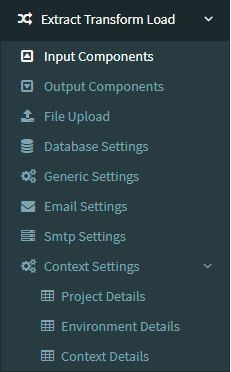

## Extract, Transform and load Helpers

 These are basically helpers for you to build automated ETL jobs, meaning that you can store information on database dynamically and use the same information in your ETL jobs, you can edit them in the jobseeker web ui, so when you won't need to rebuild your ETL jobs in case a change is needed. 

 For example, let's supose you have 500 ETL jobs running in your infrastructure through python, talend, whatever, and you have hardcoded values in your ETL job such as database settings, parameters, emails, files, directories, and you recieved a change request to replace all these information across your jobs, this would be a huge time waster if you don't have all of your information centralized somewhere, so using a database and a ui tool to replace datavalues for whenever you need, in many environments , is a great deal.

 ### Available Options

1) [Input Components](inputcomponents)
2) [Output Componentes](outputcomponents)
3) [File Upload](fileupload)
4) [Database Settings](dbsettings)
5) [Generic Settings](genericsettings)
6) [Email Settings](emailsettings)
7) [Smtp Settings](smtpsettings)
8) [Context Settings - Projects](projectsettings)
9) [Context Settings - Environments](envsettings)
10) [Context Settings - Context Details](contextsettings)

Sidebar Menu Options:

