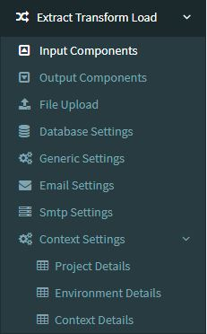

## Extract, Transform and Load Helpers

These helpers keep runtime configuration outside your ETL code. Update an environment value, dataset, email, or connection in the JobSeeker UI without rebuilding every Talend, Apache Hop, Python, Bash, or containerized job that consumes it.

For example, a file named `customers.csv` can be registered as `customer-reference`, scoped to `PROD`, and replaced later without changing the Python or shell code that resolves that asset key.

 ### Available Options

1. [Data Assets](data-assets) — uploaded datasets, runtime inputs, generated outputs, format metadata, versioning, and checksums.
2. [Connectors](connectors) — globally scoped credentials and endpoint metadata for databases, APIs, storage, queues, streaming, SFTP, and custom ETL clients.
3. [Pipelines](pipelines) — grouped drag-and-drop Jenkins workflows with sequential, parallel, conditional, recovery, and fan-in execution.
4. [Apache Hop](apache-hop) — visual data integration workflows and pipelines executed by Jenkins, with connectors published as Hop database connections and Data Assets as Hop variables.
5. [Email Settings](emailsettings)
6. [SMTP Settings](smtpsettings)
7. [Context Settings](contextsettings) — projects, environments, and runtime key/value configuration.

[Generic Settings](genericsettings) is a legacy compatibility page for custom ETL code that reads its table directly. New runtime variables belong in Context Settings.

The legacy Input Components, Output Components, and File Upload URLs now lead to Data Assets. Existing registrations are imported into the unified catalog automatically.

Legacy sidebar example:

