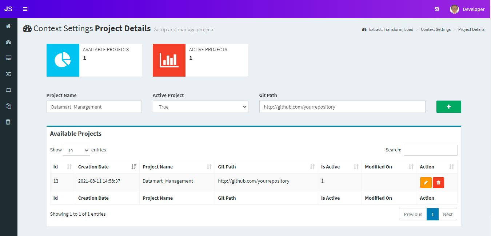
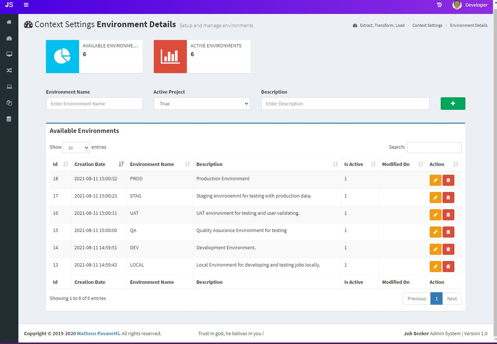
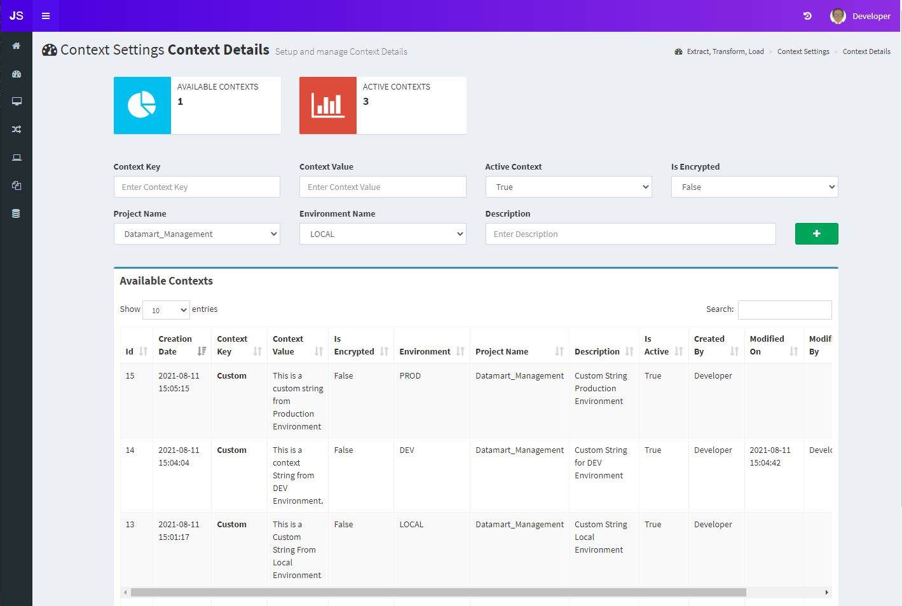

## Context Settings
This section is used for having dynamic project and environments key value pairs to be called from an ETL job.  
This is separated by three subjects 
1) **[Project Details]**: Here you create projects
1) **[Environments Details]**: Here you create environments
1) **[Context Details]**: Here you create dynamic contexts

## Project Details
Use this section to add a project, to separate your contexts by projects, add a git path optionally, and select the active project status.

## Environments Details
Use this section to create environments, Select an environment name, active project status and an optional description. 
I Recommend useing the following environment names:
- LOCAL
- DEV
- QA
- UAT
- STAG
- PROD

## Context Details
Use this section to create your contexts based on a key and value pairs, select the active status, is encrypted when you use encrypted password, to call a decryption method in your etl job for example, also select a project name and environment and use a description optionally. 
For example, the key Custom has been added for the environments LOCAL, DEV and PROD, each of them has a different value, when creating a job you can specify with environment the job will run, respectively the job will use the values setup, this is good for projects which has different environments and you don't need to rebuild your entire job for switching environments, use this solution to run the same job with different environment values.

