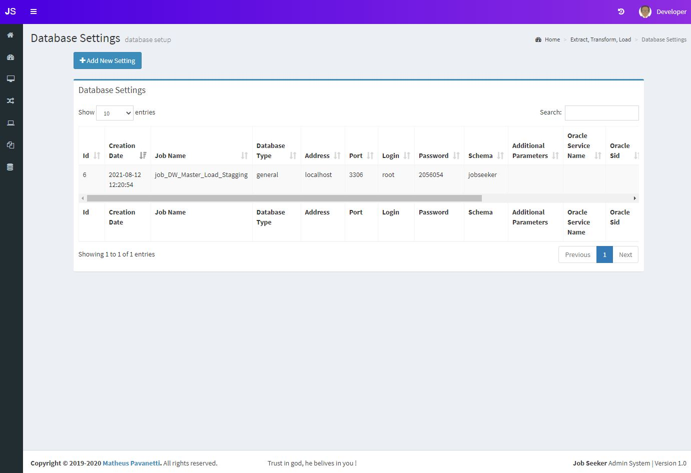
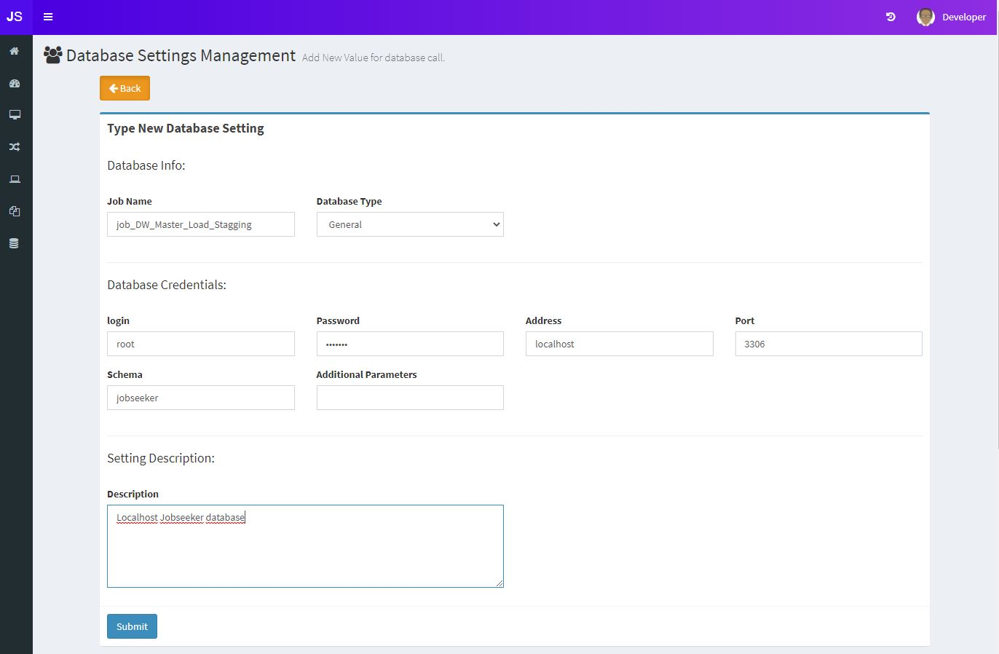
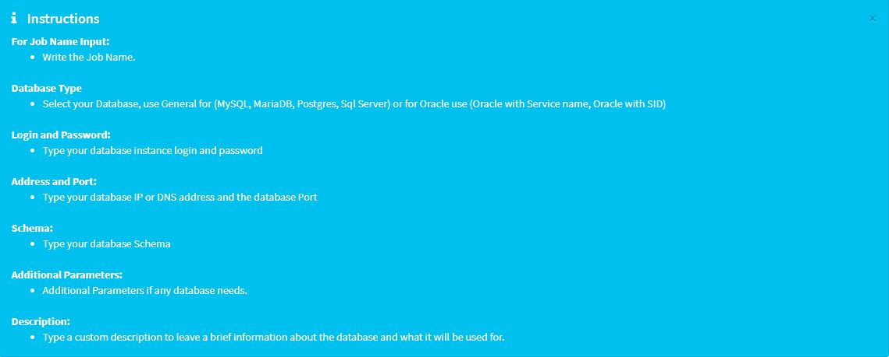

## Database sttings
This section is useful for using dynamic database connections and store credentials. You can call these parameters from db_settings table in your ETL job.

### Table list
This table contains the database credentials for your ETL job, the password will only appear for those who has permissions.

### Add new Database setting
Add your database credentials on this form and click on submit

 

### Instructions

