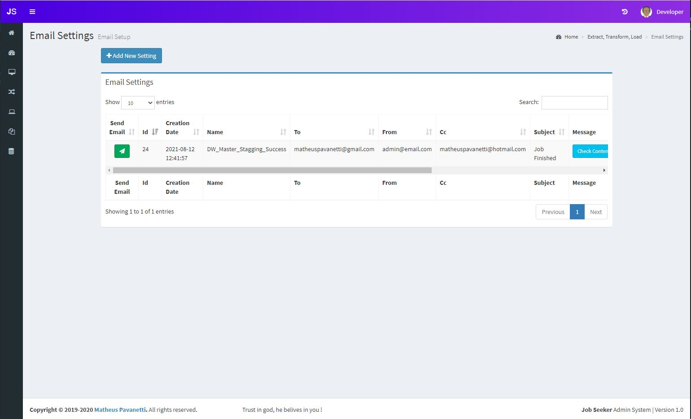
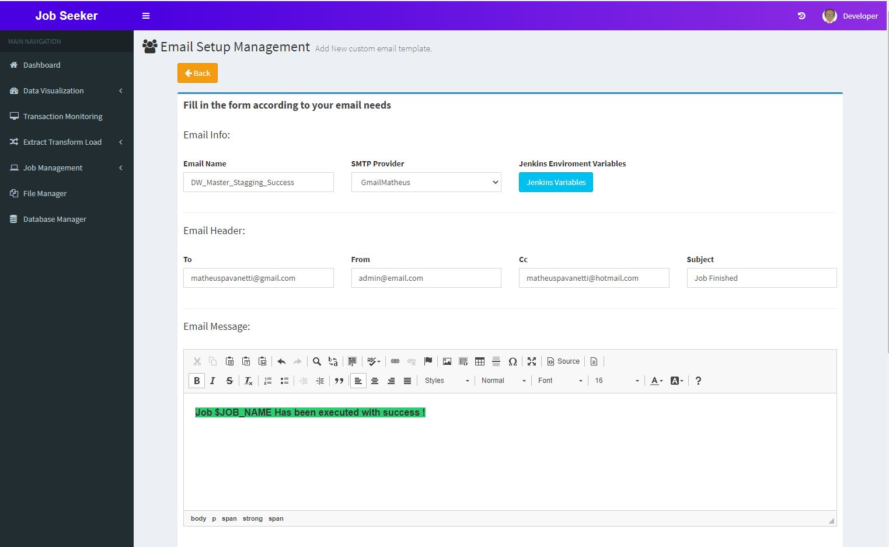
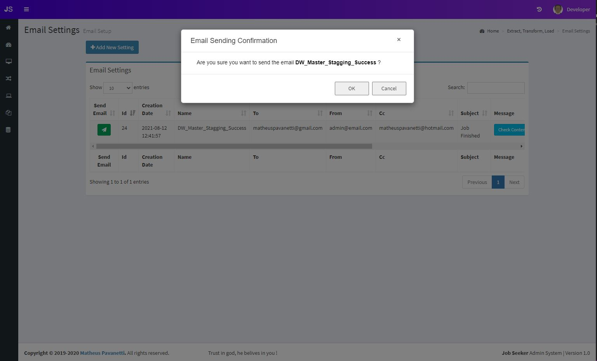
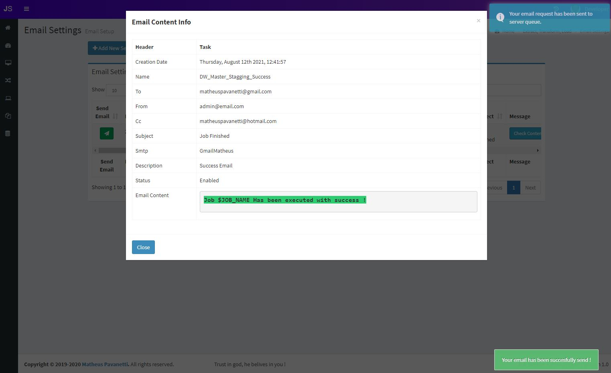

## Email Settings
This area is useful for those that wants to have a dynamic email template to be sent when your ETL job finishes, you can create the template and send through jenkins when your build finish on error and/or on success.

## Table List
Here is the table record list, you can click on send email to test the email, and also check the email body in the "Message" button.

### Add Email Template
FIll in the form with the information you need for sending email, you can write your email body in the email message section, you can use jenkins variable to be replaced in runtime 
This can be sent automatically from jenkins or manually in your etl job.

### Send Email Button
Confirm the email and send.

### Message Button
