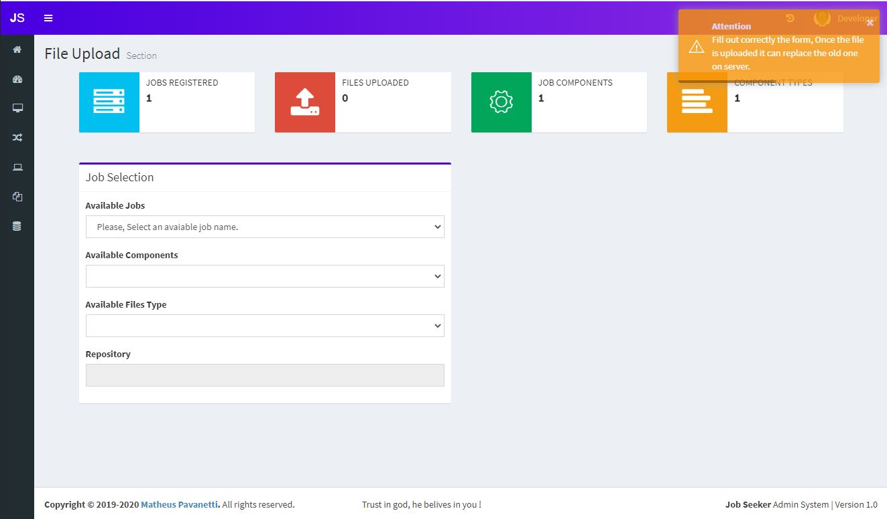
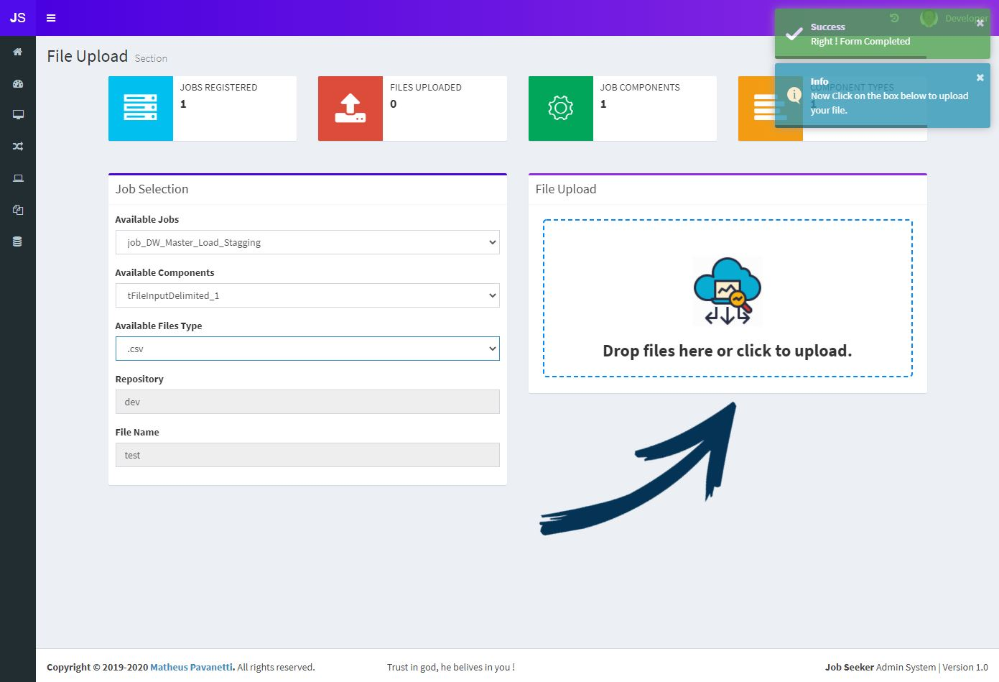
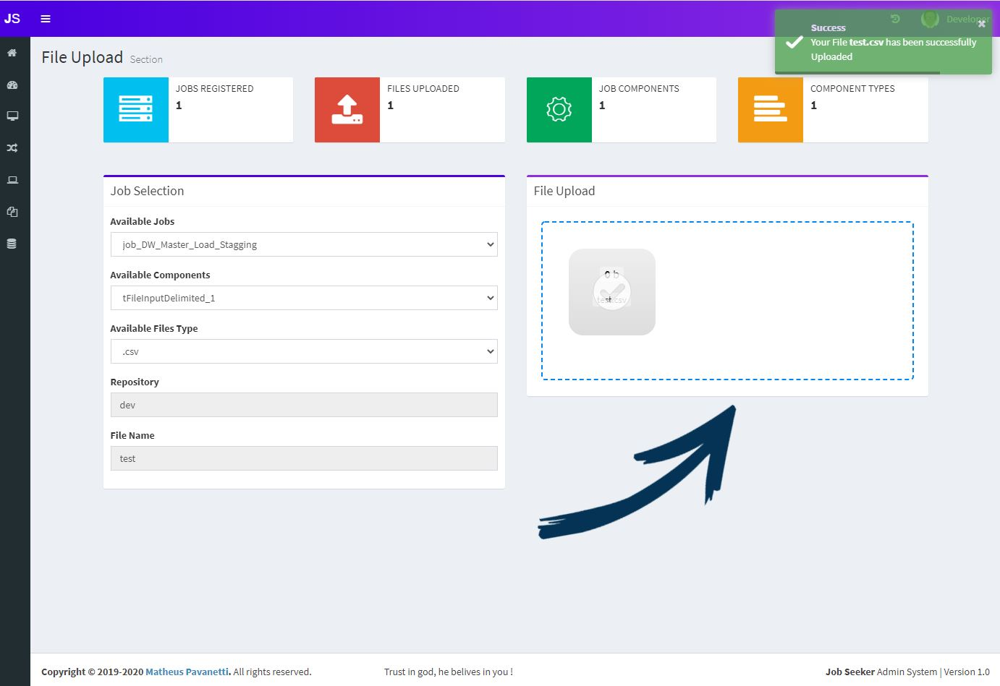

## File Upload
This section is used when you have created an input component and wants to manually feed a file into the directory you have setup dynamically in the input component area.

### Home Screen

### Uploading a file
Note that when you create an input component , it will appear in the Available Jobs dropdown Menu in the way you created. 
Once you fill in the form with the values created in the input component, it will prompt you to upload a file with the filename you created. 
You can drag and drop or click in the dropzone on the right.

 

Uploading the file test.csv 
Once you get the success message, it means your file has been successfully uplodaed to the jobseeker repository folder according to your input component setup. 
For example in this case it will be: **jobseeker/repository/talend/input/dev/test.csv**  
So now you can call this file in your ETL job.

