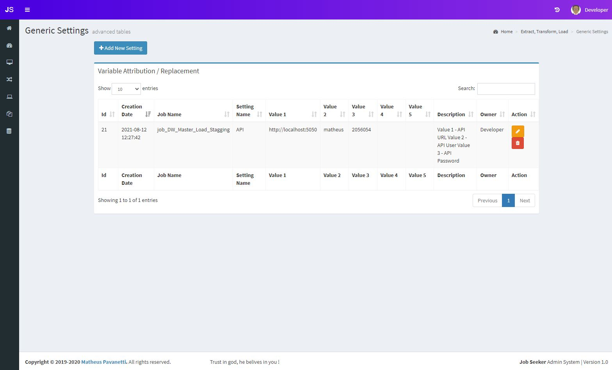
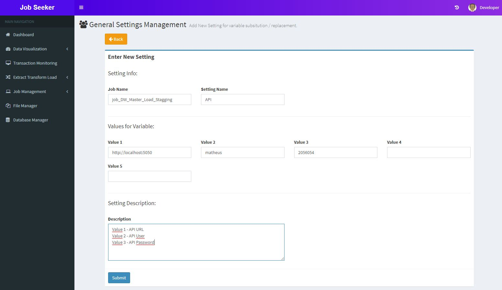

## Generic Settings (Legacy)
Generic Settings is retained only for older ETL code that queries the `generic_settings` database table directly. JobSeeker does not inject these records into Jenkins, Python, Talend, shell, or container runtimes.

Use [Context Settings](../contextsettings) for new runtime variables. Context Details provides one value per key, project, and environment; the Python SDK resolves those values through `get_context`, and Talend or shell jobs can use the same environment selected at job runtime.

The five generic value columns have no defined environment mapping, so they cannot be migrated automatically without guessing. Convert any existing rows manually by creating one Context Details record for each environment-specific value.

### Table List
here is the table records list

### Existing Settings
The legacy page remains available by URL so existing values can be inspected or maintained while custom consumers are migrated.

### Replacement
Create a stable key in Context Details for every project/environment pair that needs a distinct runtime value.