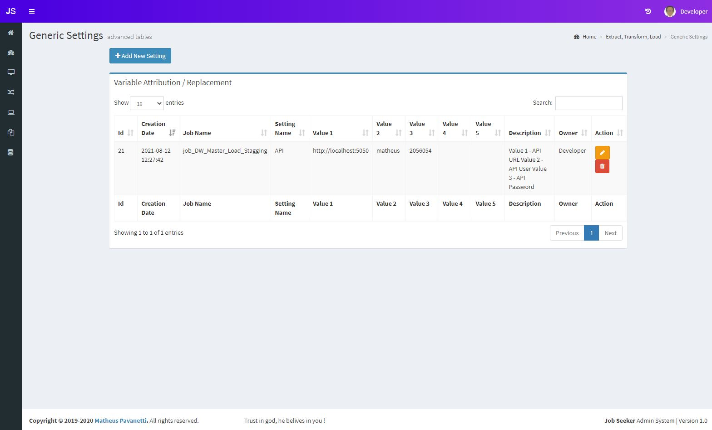

## Generic Settings
This area is useful for setting up generic parameters to your ETL job, values that instead to be hardcoded, it can be dynamically stored into the generic setting joseeker table, and you can have up to 5 values to a key, and multiple keys in a job, think that these values can change in a time, so storing it dynamically is always a good idea.

### Table List
here is the table records list

### Adding a new Setting
Fill in a job name, a setting name as a key and up to 5 values, and add a description, then you can call these values in your job from the generic setttings table.

### Instructions
