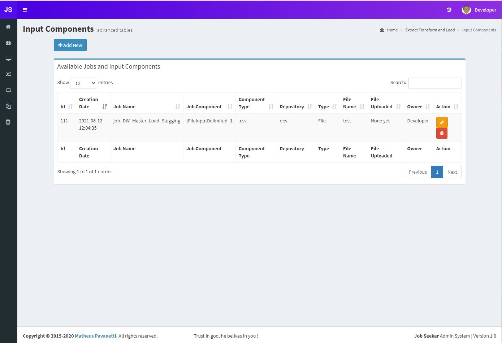
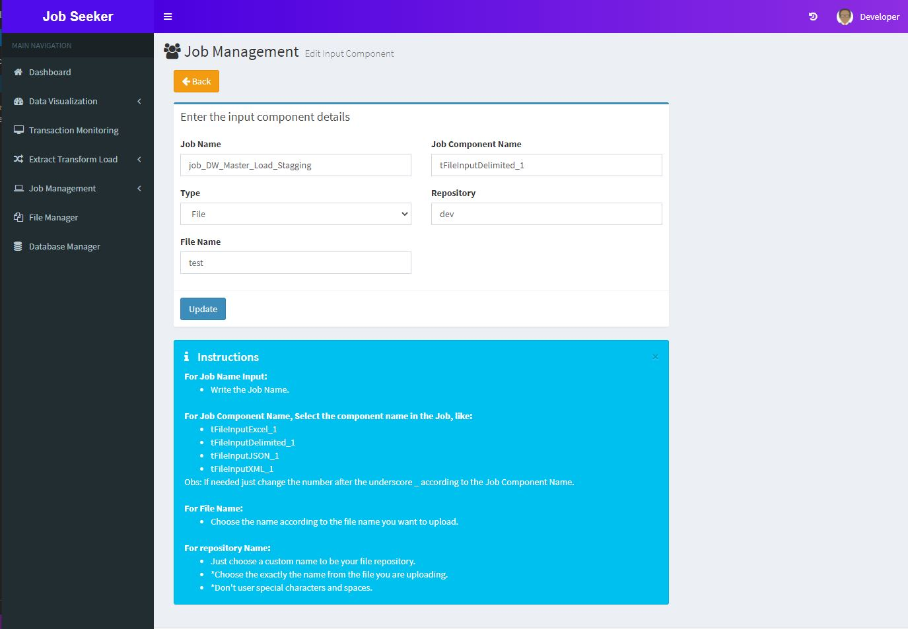

## Input Components (legacy)

Input Components has been folded into [Data Assets](../data-assets). Register an asset with the **Input** role and optionally upload its first version in the same form. Python and shell jobs resolve the asset key at runtime instead of querying the old component table or hardcoding a Talend path.

### Table
This table contain your input file or directories registries.

 

### Add New Input Component

Here you can select between file or directory input and choose your Repository/Environment, you can type whatever word you want in the repository, it means different folders will be created. 
Follow the instructions below to create a input component record.

