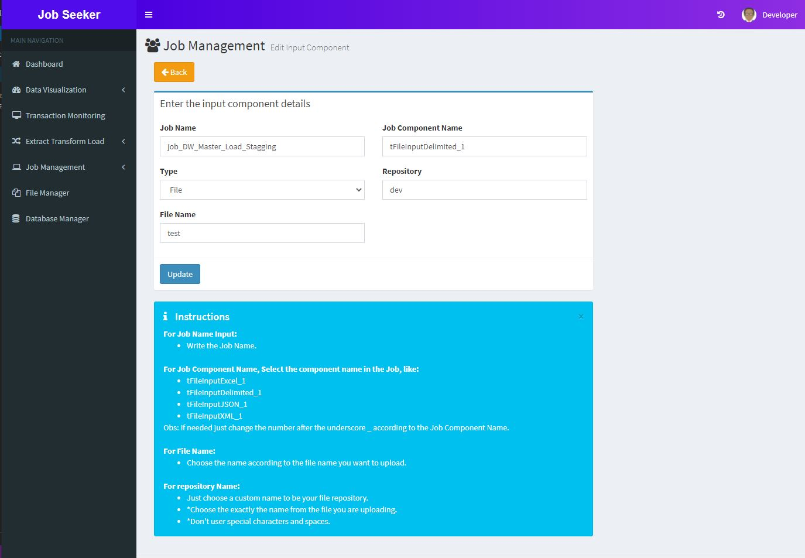

## Input Components
This area has the idea of having a way to input files to feed your ETL process dynamically, so that you can specify your file location or folder location and the environment and call it your etl job by reading the database table. this was most designed for Talend users but can also be used by python etl jobs.

### Table
This table contain your input file or directories registries.

 

### Add New Input Component

Here you can select between file or directory input and choose your Repository/Environment, you can type whatever word you want in the repository, it means different folders will be created. 
Follow the instructions below to create a input component record.

