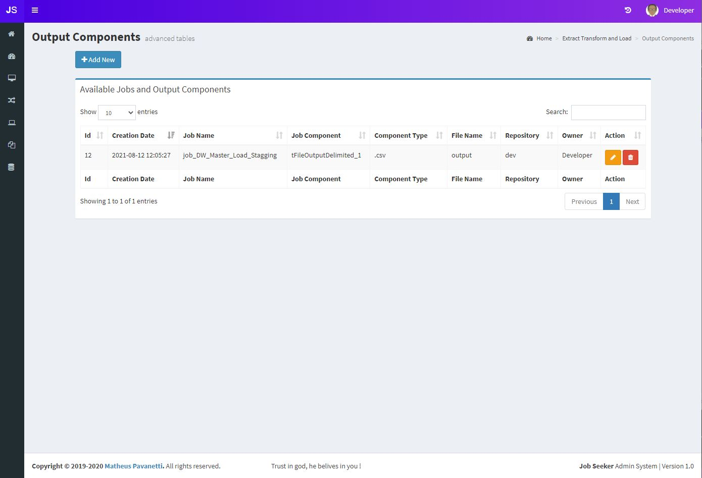
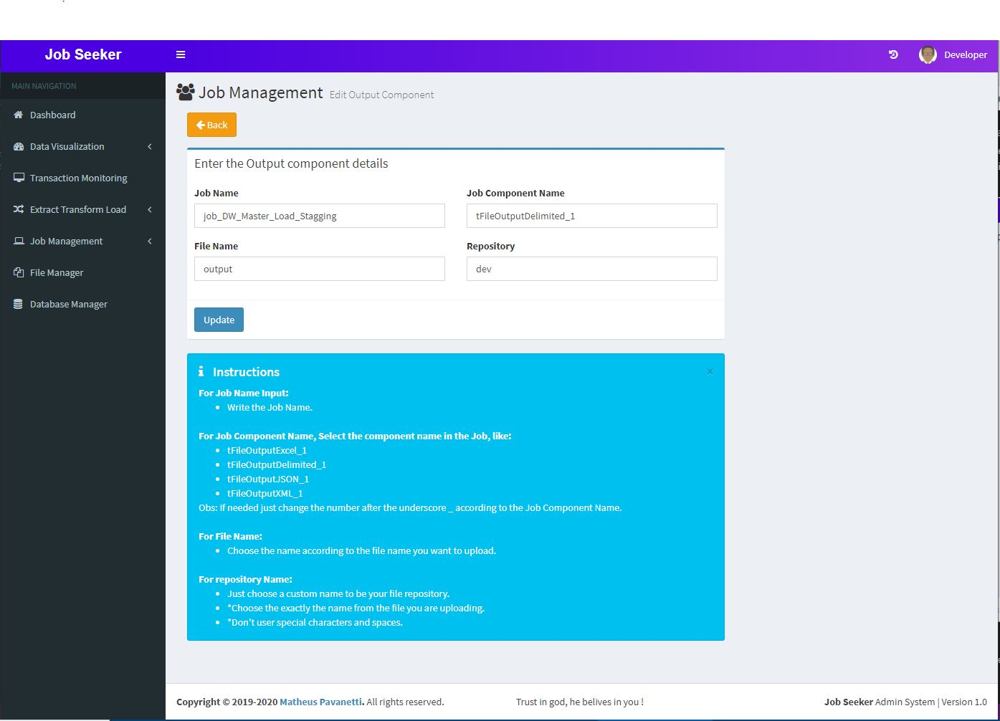

## Output Components (legacy)

Output Components has been folded into [Data Assets](../data-assets). Register an asset with the **Output** role to give jobs a governed, environment-aware write destination, or use **Input + output** for a handoff consumed by downstream jobs.

### Table
This table contain your output file registries.

 

### Add New Output Component

Here you can select between file or directory output and choose your Repository/Environment, you can type whatever word you want in the repository, it means different folders will be created. 
Follow the instructions below to create a output component record.

