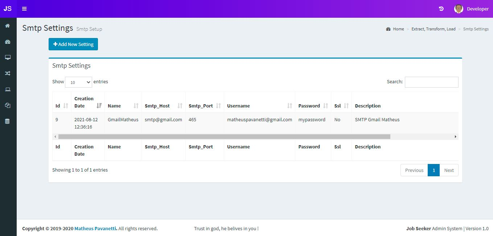
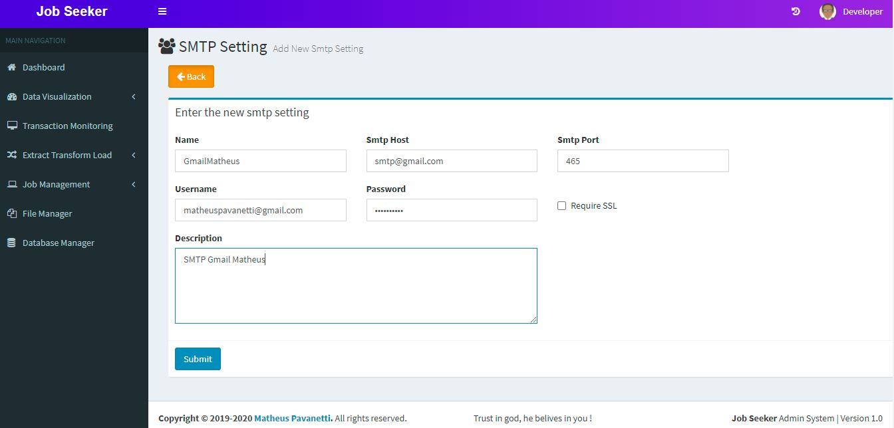

## SMTP Settings
This are is for setting up SMTP providers for sending emails when your task build finishes. 
This can be called from an ETL job or using jenkins.

### Table List
These are the listed records.

### Add a SMTP Provider
Fill in the form below using your SMTP provider info.
