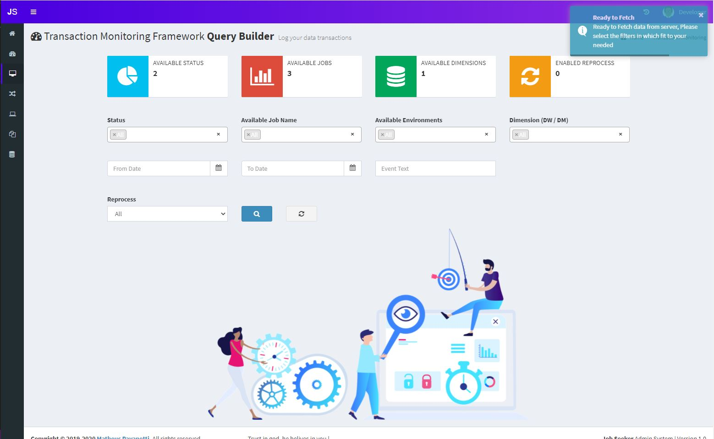
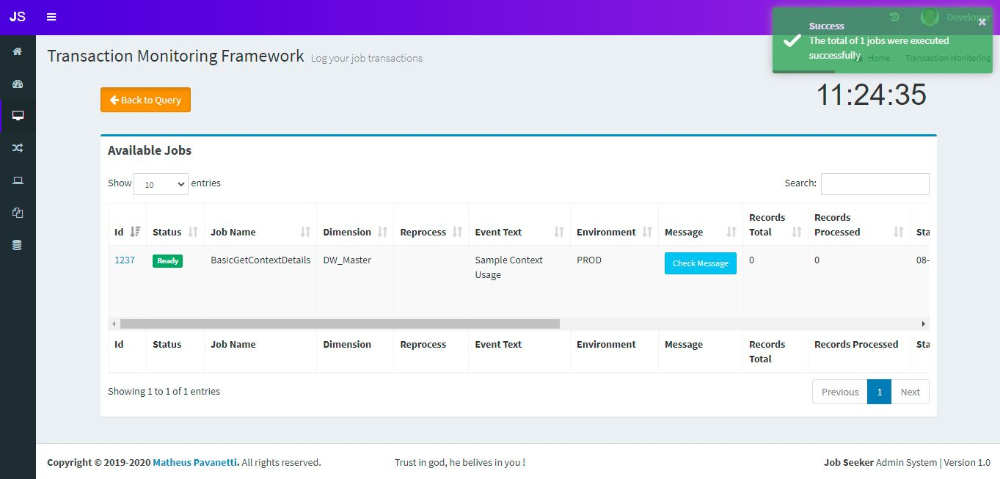
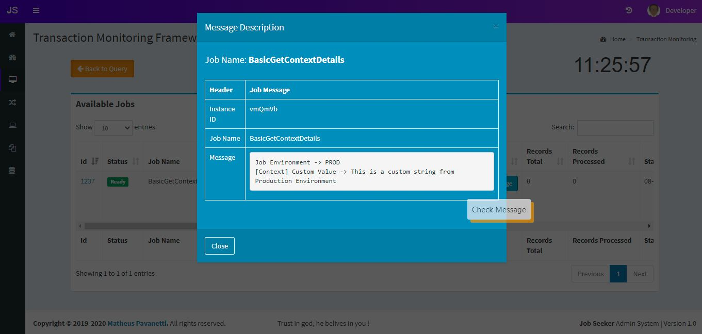
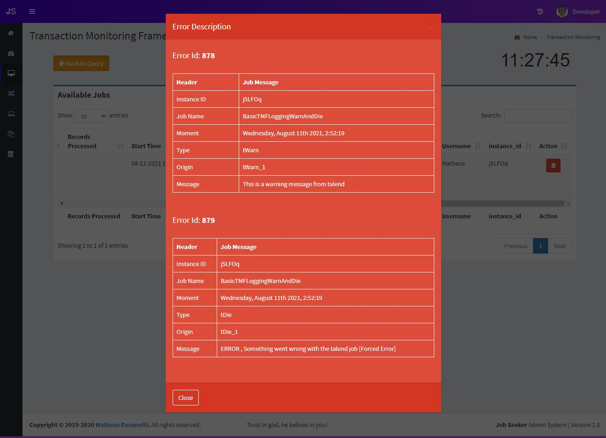

## Transaction Monitoring Framework

### This is a logging framework which let you store your ETL jobs info, such as status, messages, errors, warnings, infos, custom html texts, and more.

You can use the query builder area to filter your ETL jobs, specifying which environment you want to check, which job, which status, from when to when, etc.

### Transaction Monitoring Query Builder:
In this area you can, select and filter by status, job name, environments, dimension, from and to dates, event text, reprocess flag.

 

### Query Result

Here you can see your query result based on the filter you have choosen, 

 

### Message Button
Click on this button to get a better view or the column msg, you can write html text into this column and have a nice visualization for logging purpouse.

 

### Show Errors button
Click on this button to list the job execution available errors and warnings

 

You can also delete the logs entries if you need to.